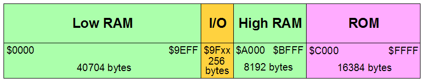

# More Memory

[Back to CX16 Root](../README.md)

## Contents

* [Introduction](#introduction)
* [Expanding Memory](#expanding-memory)
   * [Memory Address Translation](#memory-address-translation)
   * [Bank Switching](#bank-switching)
   * [Dedicated Memory](#dedicated-memory)
* [Putting it all together!](#putting-it-all-together)
   * [Speed](#speed)
   * [Usable Memory](#usable-memory)
* [Summary](#summary)

## Introduction

I distinctly remember being very impressed when I first heard of the Commodore
64 computer. It felt like we were finally getting a machine with a "full"
64K of memory. This feeling lasted until the machine was turned on and I saw:

Only 38911 bytes free. What was going on? Why so little?

At this point the reality of needing OS and language ROMs, I/O devices, video
buffers, the zero and stack pages, and BASIC interpreter data overhead sank in.

That was then. This is now!

The Commander X 16 has as goals being faster (8MHz) with a bucket of memory
(up to 2304K). The W65C02S chip generates a 16 bit address. This allows the
addressing of 65,536 bytes, usable for RAM, ROM, Video, and various
Input/Output (I/O) devices. This is called 64K (for 64 x 1024). Now when the
original 6502 was released in 1975, 64K was a lot of memory. Today, it's
considered extremely small. This is the central issue behind the topic of
_more memory_.

How is this enormous gap to be bridged? Let's get back to basics. In a typical
system, the processor sends address information to memory which is used to
select the memory location being read from or written to. As mentioned
previously the W65C02S supplies 16 bits of address which allows for 64K. Thus,
for _more memory_ we will need _more address bits_.

[Back to the Top](#more-memory)

## Expanding Memory

So we are now led to the next crucial issue: How do we obtain more address
bits? There are generally three schools of thought for doing this:

[Back to the Top](#more-memory)

### Memory Address Translation

In this model, all addresses leaving the core
CPU go through a function that maps (or translates) CPU addresses to a
typically larger address. Historically there have been a number of ways this
can be done:

The most common is to have a small memory that takes as its address a few
of the higher order address bits from the CPU and replaces them with more
bits. This memory device is in effect a hardware based table-look-up that is
indexed by (part of) the CPU address and whose table values are physical
memory addresses.

A typical example of this is the now obsolete 74LS610 chip that took
the upper 4 bits of CPU address and replaced them with 12 bits, thus
expanding the address bus from 16 to 24 bits and expanding addressable memory
from 64K to 16,384K or 16M (for 16 x 1024K).

Another approach from history is to integrate translation registers into the
CPU and add these registers to address with a shift. For example a shift of
four bits would result in addresses being added to a 20 bit value (16 plus
four zeros from the shift). This would allow up to 1,024K or 1M to be
accessed. This mapping method went by the name "segmentation". This approach
was used in the old 8086 and its stripped down sibling the 8088. Later chips
elaborated on this idea but that is beyond the scope of this discussion.

Oh, and by the way, the Commander X 16 does _not_ use memory address
translation.

[Back to the Top](#more-memory)

### Bank Switching

An alternative to memory address translation, bank switching has a long, if
checkered past, in the world of 8-bit computers. While memory address
translation is normally applied to all CPU addresses during each memory cycle,
bank switching is applied directly to the address inputs of selected memory
devices.

Let's move away from the abstract and start to look more closely at the
Commander X 16. Here is a simplified memory map of that computer:

So, for example, when the CPU address is between $0000 and $9EFF (or 0 through
40703 in decimal) the chips of the Low RAM region are enabled. There is no
bank switching for the Low RAM (currently). We skip over the I/O area as it
is a special case (I/O devices and not memory at all). Next for addresses $A000
through $BFFF (or 40960 through 49151 decimal) the High RAM is selected and
finally for addresses $C000 through $FFFF the ROM is selected.

These last two areas _do_ use bank switching. Here are the details:

Region   | CPU Address Bits | Bank Size | Bank Address Bits | # Banks | Total Bits | Total Size |
---------|:----------------:|:---------:|:-----------------:|:-------:|:----------:|:----------:|
High RAM |      13 bits     |     8K    |       8 bits      |   256   |     21     |   2048K    |
ROM      |      14 bits     |    16K    |       3 bits      |   8     |     17     |    128K    |

This all begs the question: Where do the Bank Address Bits come from? It turns
out to be pretty simple. The I/O region contains two eight bit output
registers. The eight bits of one of those registers connects to the upper 8
address lines of the High RAM memory chips. Three bits from the other register
connect to upper 3 address lines of the ROM memory chip. Currently, the
remaining five bits of that register are marked as reserved for future use.
Together, these two registers allow access to a total of 2176K of RAM and ROM.

[Back to the Top](#more-memory)

### Dedicated Memory

A third way to add more memory to a computer system is to not connect it to
the CPU at all. The astute reader will have noted that the maximum memory of
the X16 was listed as 2304K. So far we have accounted for only 2176K. Where is
the missing 128K? It is not connected to the CPU but instead is controlled by
the "VERA" video chip. This last chunk of memory is used to hold the
characters, tiles, bitmaps, and sprites used by the system display. The CPU
only has access to this memory via the control/status registers of the VERA
chip.

[Back to the Top](#more-memory)

## Putting it all together!

Now let's see how the memory expansion strategies of the Commander X 16 line
up with its design goals!

[Back to the Top](#more-memory)

### Speed

One aspect left out of the discussions of Memory Address Translation, Bank
Switching, and Dedicated Memory is the impact on system speed.

Since address translation must be performed before each memory cycle can
commence, time spent on that translation is time not available to the memory
devices to do their job of reading or writing data. It is said that the
address translator is in the "critical path" of the design.

In contrast, bank switched address lines do not depend on the CPU address.
They are always present and are _not_ in the critical path. This allows for
faster system speeds.

In addition, the video display requires a great deal of memory bandwidth to
create lively and colorful displays. In a system with shared memory, that
memory bandwidth is not available to the CPU. Either the CPU must run more
slowly or faster memory chips must be used. The memory bandwidth problem
was especially acute in the C64 where the video controller would greatly
reduce the effective processor speed during what were called "bad" scan lines.
The dedicated memory connected to the VERA chip means that none of the video
display bandwidth is at the expense of CPU performance.

Don't get me wrong; There are plenty of other ways to nerf system speed. The
designers of the Commander X 16 have just made sure that memory expansion is
not one of them.

[Back to the Top](#more-memory)

### Usable Memory

All programs generally use memory in two distinctive ways:

1. To hold the code of the program along with supporting libraries.
2. To hold the data of the program. This can include text, spreadsheet data,
game maps, game data, images, sounds, music, and much more. The video frame
buffer, tiles, sprites, bitmaps, and other sundries also fall into this
category.

Starting off, the dedicated video memory means that no matter what video mode
is selected, CPU memory will not be hoarded by the video interface controller
(VERA) chip.

So how is CPU memory to be used effectively?

Let's start from the top with the ROM. The banked ROM means that it should be
possible to create specialized operating modes. Currently proposed for this
(and thus subject to change) are:

| Bank|  Name  | Description                                           |
|:---:|:------:|-------------------------------------------------------|
| 0   | KERNAL | Character sets (uploaded into VRAM), MONITOR, KERNAL  |
| 1   | KEYBD  | Keyboard layout tables                                |
| 2   | CBDOS  | The computer-based CBM-DOS for FAT32 SD cards         |
| 3   | GEOS   | GEOS KERNAL                                           |
| 4   | BASIC  | BASIC interpreter                                     |
| 5   |   –    | *Reserved*                                            |
| 6   |   –    | *Reserved*                                            |
| 7   |   –    | *Reserved*                                            |

While one could envision the addition of a application language runtime into
one (or more) of the reserved ROM banks, the ROM will generally not be of much
help for holding application code or data. Of course, a great deal of code
and data could be held in an attached FAT32 SD card (accessed via the services
of ROM bank 2), but that is another topic entirely.

So what's available? There's the 39K of low RAM and the 512K, 1024K, 1536K, or
2048K of high, banked RAM. Now the low RAM is perfect for holding application
code. 39K can hold a _lot_ of W65C02S assembly code plus working variables.
That leaves the high banked RAM to hold previously mentioned text, game maps,
game data, images, sounds, music, etc, etc, etc.

As you might expect, some of the high, banked RAM is also reserved. This is
complicated by the fact that the X16 may be supplied with four levels of
high, banked RAM installed:

High, Banked RAM      | 512K  | 1024K  | 1536K  | 2048K  |
----------------------|:-----:|:------:|:------:|:------:|
Application           | 0..62 | 0..126 | 0..190 | 0..254 |
DOS Buffers/Variables |  63   |  127   |  191   |  255   |

**TBD**: How can the amount of high, banked RAM installed be determined? The
system "kernal" is to include a call to determine the amount of memory
installed, but as of this writing, this is  entirely in a state of flux and
likely to change.

[Back to the Top](#more-memory)

## Summary

I am glad to say that a great deal of thought and care has gone into the
design of the extended memory architecture of the Commander X 16. The design
takes into account, not only how the hardware performance will be affected,
the costs and complexities involved, but most important of all, how the
memory will be utilized in typical applications.

Areas needing work will be assembler library and high level language support
for the high, banked RAM, but as software that development can wait until
the design is "out there" and established. It will probably be true that the
language to effectively use this resource will have a huge advantage on this
new platform.

[Back to the Top](#more-memory)
