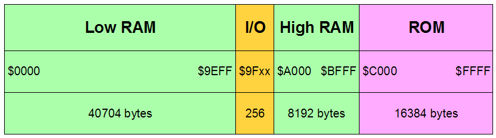

# More Memory (WIP)

The Commander X 16 has as goals being faster (8MHz) with a bucket of memory
(up to 2088K). The W65C02S chip generates a 16 bit address. This allows the
addressing of 65,536 bytes, usable for RAM, ROM, Video, and various
Input/Output (I/O) devices. This is called 64K (for 64 x 1024). Now when the
original 6502 was released in 1975, 64K was a lot of memory. Today, it's
considered extremely small. This is the central issue behind the topic of
_more memory_.

How is this enormous gap to be bridged? Let's get back to basics. In a typical
system, the processor sends address information to memory which is used to
select the memory location being read from or written to. As mentioned
previously the W65C02S supplies 16 bits of address which allows for 64K. Thus,
for _more memory_ we will need _more address bits_. How do we obtain more
address bits? There are generally two schools of thought for doing this:

**Memory Address Translation**: In this model, all addresses leaving the core
CPU go through a function that maps (or translates) CPU addresses to a
typically larger address. Historically there have been a number of ways this
can be done:

The most common is to have a small memory that takes as its address a few
of the higher order address bits from the CPU and replaces them with more
bits. This memory device is in effect a hardware based table-look-up that is
indexed by (part of) the CPU address and whose table values are physical
memory addresses.

A typical example of this is the now obsolete 74LS610 chip that took
the upper 4 bits of CPU address and replaced them with 12 bits, thus
expanding the address bus from 16 to 24 bits and expanding addressable memory
from 64K to 16,384K or 16M (for 16 x 1024K).

Another approach from history is to integrate translation registers into the
CPU and add these registers to address with a shift. For example a shift of
four bits would result in addresses being added to a 20 bit value (16 plus
four zeros from the shift). This would allow up to 1,024K or 1M to be
accessed. This mapping method went by the name "segmentation". This approach
was used in the old 8086 and its stripped down sibling the 8088. Later chips
elaborated on this idea but that is beyond the scope of this discussion.

Oh, and by the way, the Commander X 16 does not use memory address translation.

**Bank Switching**:

An alternative to memory address translation, bank switching has a long, if
checkered past, in the world of 8-bit computers. While memory address
translation is normally applied to all CPU addresses during each memory cycle,
bank switching is applied directly to the address inputs of selected memory
devices.

Let's move away from the abstract and start to look more closely at the
Commander X 16. Here is a simplified memory map of that computer:

So, for example, when the CPU address is between $0000 and $9EFF (or 0 through
40703 in decimal) the chips of the Low RAM region are enabled. There is no
bank switching for the Low RAM (currently). We skip over the I/O area as it
is a special case (I/O devices and not memory at all). Next for addresses $A000
through $BFFF (or 40960 through 49151 decimal) the High RAM is selected and
finally for addresses $C000 through $FFFF the ROM is selected.

These last two areas _do_ use bank switching. Here are the details:

Region   | CPU Address Bits | Bank Size | Bank Address Bits | # Banks | Total Bits | Total Size |
---------|:----------------:|:---------:|:-----------------:|:-------:|:----------:|:----------:|
High RAM | 13 bits          |  8K       |  8 bits           |  256    |     21     | 2048K      |
ROM      | 14 bits          | 16K       |  3 bits           |   8     |     17     |  128K      |

This all begs the question: Where do the Bank Address Bits come from? It turns
out to be pretty simple. The I/O region contains two eight bit output
registers. The eight bits of one of those registers connects to the upper 8
address lines of the High RAM memory chips. Three bits from the other register
connect to upper 3 address lines of the ROM memory chip. Currently, the
remaining five bits of that register are marked as reserved for future use.
Together, these two registers allow access to a total of 2176K of RAM and ROM.

WIP

All programs generally use memory in two distinctive ways:

1. To hold the code of the program along with supporting libraries.
2. To hold the data of the program. This can include text, spreadsheet data,
game maps, game data, images, sounds, music, and much more.
