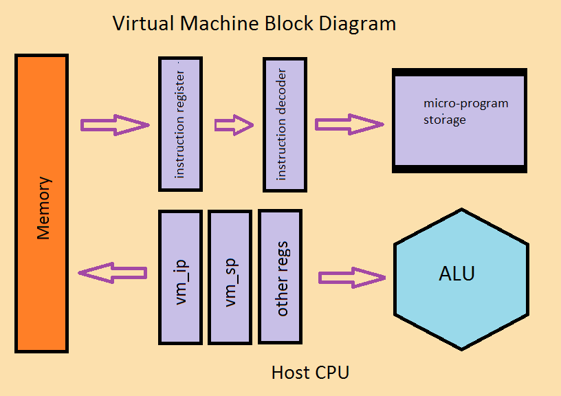

# Virtual Machines

[Back to CX16 Root](../README.md)

## Contents

* [Introduction](#introduction)
   * [A little overview](#a-little-overview)
* [Virtual Machines](#virtual-machines-1)
   * [Sweet-16](./sweet_16.md)
* [Work In Progress](#work-in-progress)
   * [AcheronVM](#acheronvm)
      * [_Repository_](https://github.com/AcheronVM/acheronvm)
      * [_Video_](https://youtu.be/zdJnz6-d060)
   * [Threaded Interpreters](#threaded-interpreters)
   * [Initializer](#initializer)
* [Coding Concepts](#coding-concepts)
   * [Initial Choices](#initial-choices)
   * [Sample VM layouts](./vm_layouts.md)
   * [The VM Instruction Pointer](./vm_ip.md)
   * [Decoding VM Instructions](./vm_id.md)
   * [Implementing VM Stacks](#implementing-vm-stacks)

## Introduction

The [**Wikipedia**](https://en.wikipedia.org/wiki/Virtual_machine) defines a
virtual machine as:

_In computing, a virtual machine (VM) is an emulation of a computer system.
Virtual machines are based on computer architectures and provide functionality
of a physical computer. Their implementations may involve specialized hardware,
software, or a combination._

In this study we will focus on software based virtual machines for the
W65C02S processor in the Commander X 16 neo-retro computer.

The above definition states that a VM allows one computer system to emulate
another. What it does not mention is that the machine being emulated may not
actually exist. Contrary to the definition, it is often desirable to emulate
machines that are in fact purely hypothetical in nature. This can allow the
emulation of a processor more ideally suited to a specific task than any
"real" system.

This dove tails nicely with the "onion" system model, where hardware and
software are composed of many layers like an onion; Each layer of the system
"wrapping up" the layers below it. A VM is just such a layer.

VMs take many forms so that it is no surprise that over the years, many names
have been given to this concept. Some alternatives are:

* Byte Code Interpreter - a subclass of virtual machines with byte codes.
* P-Code Interpreter - The VM for UCSD Pascal.
* TIL - Threaded Interpretive Language, the most prominent being FORTH.
* YARV - Yet Another Ruby Virtual machine, introduced in Ruby 1.9.0
* JVM - Java Virtual Machine. Famous for running on many hosts and for being
the target of many compilers beyond the original Java.
* EVM - Erlang Virtual Machine. Noteworthy in support of functional
programming with Erlang and Elixir.
* LLVM - This was formally formally known as the Low Level Virtual Machine.
It is an exception as it is not really a virtual machine at all. It is no
longer being developed as an execution target. Rather it is more of a mid
level abstract compiler construct.
* MetaProcessor - the label given to the  virtual coprocessor for the
Apple \]\[. Also called the Pseudo Machine Interpreter. (See below)

[Back to the Top](#virtual-machines)

### A little overview

Every CPU comes with a block diagram that identifies its major working parts.
Now virtual machines are a diverse lot, so the generic block diagram is pretty
well generic. Here it is:

It may provide more insite to take a look at the "shampoo instructions" model
of virtual machine activity:

<pre><code>fetch &rarr; decode &rarr; execute &rarr; repeat</code></pre>

This basic mantra is the core of any virtual machine design. Its performance
is vital to the success of the whole endeavor. Put another way, the virtual
machine is incapable of running any faster than this loop, so every effort
must be made to make it fast and efficient. This will be a recurring theme.

[Back to the Top](#virtual-machines)

## Virtual Machines

The CX16 Repository contains the following Virtual Machine implementations that
are intended for use in the Commander X 16 computer system.

These are virtual machines that are largely ready to be used in the Commander
X 16 system or it's emulator. At a minimum, they have passed simulation
testing and the code seems to work. They may be lacking enhancements needed
to work better in the X16, but that will require community feedback to move
forward on that front.

This list should grow over time.

As always E&OE.

[Back to the Top](#virtual-machines)

### [Sweet-16](./sweet_16.md)

This virtual machine was built into the Integer Basic of the Apple \]\[.
In fact, it is such a famous virtual machine that this repository contains a
port of it to the ca65 assembler with a W65C02S processor. Enjoy!

[Back to the Top](#virtual-machines)

## Work In Progress

These are ideas that are still being developed. If there any suggestions for
new ideas, this would be most appreciated. You can make a suggestion by raising
an issue on Github.

[Back to the Top](#virtual-machines)

### AcheronVM

The [**Acheron VM**](https://github.com/AcheronVM/acheronvm) is an interesting
effort to maximize VM performance on a 6502 system. It is described in this
[**Amazing Video**](https://youtu.be/zdJnz6-d060). I intend to look into
porting it to the X16 and maybe placing it into one of the language ROM banks.

[Back to the Top](#virtual-machines)

### Threaded Interpreters

The classic threaded interpreter for FORTH is the address indirect threaded
interpreter. In FORTH circles it goes by the name the inner interpreter. My
vision is of a language that fully supports the X16 and it's banked memory
with support for the kernel, Vera video, sound (tbd), and other peripherals.
That at least is the goal. Right now it is no more than that. To start though,
I think a study of Threaded Interpretive Language (TIL) inner interpreters
would be most beneficial to discover the trade offs of the various choices.

[Back to the Top](#virtual-machines)

### Initializer

I was once working on a Microchip PIC-32 system with a color TFT display. I
was dismayed by how much space the initialization code was consuming. So
I came up up a very simple interpreter that allowed registers to be set to
values, and pauses inserted into the code all while using only two bytes
per initialized register. It saved a lot of space. Several kilobytes actually!
Like all 8-bit systems, the Commander X 16 will also be short of space.
Perhaps it's time to dust off some old code and port it to the W65C02S?

[Back to the Top](#virtual-machines)

## Coding Concepts

And now for something completely different! In this section we examine some
of the low-level coding issues that face any programmer seeking to design a
virtual machine for the W65C02S processor. This will consist of code snippets
to illustrate concepts rather than completed code for immediate use.
It should be understood, that this study will be fraught with the need to make
compromises. It certainly cannot be ideal for all use cases. Hopefully
however, the snippets will be of use or at least be an inspiration for even
better efforts.

The examination of virtual machine concepts will deal with the following
topics:

[Back to the Top](#virtual-machines)

### Initial Choices

There are some basic questions that affect all aspects of the VM. These
questions should be answered before any code is written. Questions like:

1. Where in the system will the VM interpreter reside?

The VM interpreter is the piece of native W65C02S code, written most likely in
assembly language, but at times, "C" or some other language have been used.
This code performs that actual fetching, decoding, and execution  of VM
instructions.

Possible choices for the X16 are the 40K low RAM or in one of the unused banks
of flash memory, perhaps instead of the BASIC interpreter. It could also fit
in one of the 8k banks of the high RAM, but that would severely complicate the
use of high memory for anything else.

2. Where will the target program reside?

The target program is the input to the VM interpreter. While it is indeed a
program, it is not restricted to the instruction fetching methods used by
native code.

As a result, there are more choices here including the 40K low RAM, the bank
switched high RAM, or even directly from files on an SD flash memory device.
Yes code could be in banked flash memory, but that would not be common
except perhaps for code libraries written in VM code for brevity.

3. Where will the data, stack(s), and heap(s) reside?

In languages like "C", data is apportioned into static data for globals and
static data, a stack for return addresses, function parameters, and local
variables, and a heap for dynamically allocated data.

The 6502 base architecture predates the notion that the CPU should at least
pay lip service to the goal of not making the compiler writer's life a living
hell. While the processor stack _could_ be used for return addresses, the VM
will need to do a lot of emulating.

The 40K low RAM is a good candidate for the static data and stack. The heap
could go there as well or in the banked high memory for the ambitious.

4. How will I/O devices be supported?

Then there is  the question of how the virtual machine will support the I/O
devices of the target system. Will there be special instructions to speed
access? On the other hand, it may be desirable to use memory mapped I/O
instead.

On a slightly higher level, one could envision instructions or libraries that
support devices on a more complex level than the simple I/O ports. An example
could be to perform VIA setup or perhaps the VERA chip.

5. How will the VM coexist with native code?

At times it will be desirable to have the VM call on native code. A special
but very important cases of this would be the ability to make calls to the
ROM resources like the Kernal or the Floating Point library.

At other times, it will be useful to have VM code execute native code
"inline" by switching out of VM "mode".

6. How will the VM support unit testing?

In the CX16 repository, unit test is done with a CPU simulator. Any VM will
need a way of accessing the simulator's command level. This was done in my
port of the Sweet-16 VM by using a reserved op-code. While this is less
complex than other aspects, being able to do automated unit tests is a vital
part of producing quality code.

[Back to the Top](#virtual-machines)

### [Sample Virtual Machine Layouts](./vm_layouts.md)

Now these six questions, especially the first four, are a lot to think
about. To help let's consider some sample answers to these questions and then
see what the ramifications of those choices are in the sections that follow.

In the mean time, let's see some [**sample VM layouts**](./vm_layouts.md).

[Back to the Top](#virtual-machines)

### [The VM Instruction Pointer](./vm_ip.md)

In most processors, the instruction pointer or program counter does not get a
lot of attention. It does its job of fetching instructions quietly and without
fanfare.

In a virtual machine, this simple task is performed by one of the most crucial
bits of code. Its performance reflects on all instructions. Wasted cycles here
are wasted in everything the VM does.

The design of the instruction pointer also controls the design of those
instructions that modify it, namely branches, jumps, subroutines, and
returns.

It goes without saying that this section deserves a lot of [attention](./vm_ip.md).

[Back to the Top](#virtual-machines)

### [Decoding VM Instructions](./vm_id.md)

Perhaps the most overlooked aspect of most processors is the instruction
decoder. It does not even have any programmer visible registers and is
usually a nondescript block in high level diagrams of the CPU, if it even
appears at all.

And yes, in our virtual machine designs instruction decoding has a huge
impact, not only on the instructions we implement but also the addressing
modes available. Providing these adequately and efficiently is quite a
challenge.

Thus, this is also a major point of focus.

[Back to the Top](#virtual-machines)

### Implementing VM Stacks

Traditional micro controllers are not designed with high level languages in
mind. The same is true for nearly all 8-bit microprocessors, including the
W65C02S used in the Commander X 16. This is most evident in the area of
stacks. While there are processors with worse stacks (that's you PIC and
8051) we're dealing with a severely nerfed stack all the same.

As mentioned above, the stack is a vital data structure for dealing with all
sorts of data in a nestable, low-overhead, easy-to-understand way.

Depending on our initial choices, there will a lot to deal with here.

[Back to the Top](#virtual-machines)
