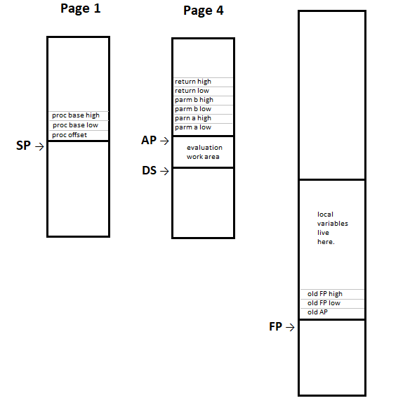

# Virtual Machine Architecture Mark 1

## Contents

* [Introduction](#introduction)
   * [Design Choices](#design-choices)
   * [Registers](#registers)
   * [Addressing Modes](#addressing-modes)
   * [Data Types](#data-types)
   * [Putting it together](#putting-it-together)
* [Core Operations Reference](#core-operations-reference)
   * [Add](#add)
   * [And](#and)
   * [Branch](#branch)
   * [Branch Short Circuit And](#branch-short-circuit-and)
   * [Branch Short Circuit Or](#branch-short-circuit-or)
   * [Call](#call)
   * [Compare](#compare)
   * [Complement](#complement)
   * [Divide](#divide)
   * [Enter](#enter)
   * [Equal Zero](#equal-zero)
   * [Exit](#exit)
   * [Extend](#extend)
   * [Jump](#jump)
   * [Load](#load)
   * [Mod](#mod)
   * [Multiply](#multiply)
   * [No Operation](#no-operation)
   * [Not Equal Zero](#not-equal-zero)
   * [Or](#or)
   * [Return](#return)
   * [Store](#store)
   * [Subtract](#subtract)
   * [Truncate](#truncate)
   * [Xor](#xor)
* [System Operations Reference](#system-operations-reference)
   * [Call Native](#call-native)
   * [Load Device](#load-device)
   * [Store Device](#store-device)
* [Simulation Support](#simulation-support)
   * [Exit Simulation](#exit-simulation)
* [Edge Cases](#edge-cases)
   * [Divide by Zero](#divide-by-zero)
   * [Undefined Op Codes](#undefined-op-codes)

## Introduction
This document contains an overview of the \<name goes here\> Compiler Virtual
Machine Architecture Mark 1. This is a highly simplified, bare bones version
of the final version and serves as a starting point for development efforts.

To be extra clear on this point, Mark 1 is not an end point. Rather it serves
as the start of an iterative process of refinement. I fully expect that at
some point, it will be necessary to restart with a clean slate in order to
move forward. Mark 1 will have helped get us to that point.

The following sections detail the programmer visible aspects of the VM1
virtual machine.

[Back to the Top](#virtual-machine-architecture-mark-1)

### Design Choices
Like many virtual machine designs, Mark 1 is a primarily a stack based
machine. It is augmented with a few specialized registers backed up with
addressing modes and instructions.

This project has already undertaken an examination of virtual machine design
choices available to the Commander X16 and its W65C02S processor. This section
links back to some of those design options in other parts of the CX16 project.
For your reference these choices are listed below:

* Instruction Pointer uses [Option 2](./vm_ip.md#option-2).
* Instruction Decoder uses [Decoder 8](./vm_id.md#decoder-8).
* Data Stack uses a [Page Stack](./vm_sp.md#the-page-stack). This stack is
augmented with an argument pointer (AP) to allow easy access to the
arguments of a procedure or function and the return value of a function.
* Return Stack uses the [System Stack](./vm_sp.md#the-system-stack).
* Local variables are held in [Simplified Stack Frames](./vm_sp.md#simplified-stack-frames)
with the addition of support for saving the AP register on _enter_ and
restoring it on _exit_. Local variable space begins at FP+4 through to
FP+255 for up to a total of 252 bytes. FP+0 is free space. FP+1 is the old
AP register. FP+2 and FP+3 are the old FP register.

The following illustrates the stack frame that is created when executing a
function with the following signature:

```
function foo(a,b:integer) : integer;
```



Notes:
* The return address is stored in the system stack in page 1. This consists
of three bytes, a 16 bit base and an 8 bit offset. This allows 85 levels of
nesting. More than enough for most applications.
* Parameters are stored in the data stack located in page 4. Function return
values are here too. In theory, all requirements could be met with just
the DS pointer, but an AP is used to simplify addressing. The return high and
low refer to the return value of the function and not the program
return address.
* Local variables are kept in the frame area. The old FP and AP are here
as well. The frame area can span multiple pages and grows downward from
the high side of the low RAM.

If all this seems a bit on the complex and cumbersome side, it is. Just like
dogs walking on two legs, getting the 6502 to run high level languages is
not noteworthy that it does it well. It is noteworthy that it does is at all!

[Back to the Top](#virtual-machine-architecture-mark-1)

### Registers
The virtual machine supports the following virtual registers:

* PB - 16 bit procedure base. Part of the instruction pointer.
* PO - 8 bit procedure offset. Part of the instruction pointer.
* RS - 8 bit return stack pointer. This stack is located in page 1.
* DS - 8 bit data stack pointer. This stack is located in page 4.
* AP - 8 bit pointer to arguments in the data stack.
* FP - 16 bit frame pointer. Points to the base of the local frame.

In addition there are these pseudo "registers", values, and operations:

* t1, t2 etc - Temporary 16 bit registers. Not programmer accessible but
mentioned since they are referenced in some of the instruction details.
* DS.pop - The result of popping a word off of the data stack.
* DS.push(value) - Push value as a word onto the data stack.
* RS.pop - The result of popping a word off of the return stack.
* RS.push(value) - Push value as a word onto the return stack.
* FP.pop -  The result of popping a word off of the frame.
* FP.push(value)-  Push value as a word onto the frame.

In addition the following operators are employed:

| Expression     | Description
|:--------------:|-------------------
|a &larr; expr   | a is assigned the value of the expression
|a + b           | a plus b
|a - b           | a minus b
|a \* b          | a times b
|a &divide; b    | a divided by b (signed)
|a U&divide; b   | a divided by b (unsigned)
|a % b           | a modulus b (signed)
|a U% b          | a modulus b (unsigned)
|a & b           | a bit-wise AND b
|a \| b          | a bit-wise OR b
|a &oplus; b     | a bit-wise XOR b
|a = b           | does a = b?
|a &ne; b        | is a &ne; b?
|a > b           | is a > b? (signed)
|a U> b          | is a > b? (unsigned)
|a &ge; b        | is a &ge; b? (signed)
|a U&ge; b       | is a &ge; b? (unsigned)
|a < b           | is a < b? (signed)
|a U< b          | is a < b? (unsigned)
|a &le; b        | is a &le; b? (signed)
|a U&le; b       | is a &le; b? (unsigned)

[Back to the Top](#virtual-machine-architecture-mark-1)

### Addressing Modes
In most cases, addressing modes are specified as a suffix to the virtual
machine op code. In some cases, where there is only one option, this suffix
is omitted. The virtual machine supports the following addressing modes:

Mode       | Suffix | Description                                         | Details
-----------|:------:|-----------------------------------------------------|--------
inherent   |  none  | Operands are contained on one of the stacks.        | Varies
immediate  |  i     | Operands are constants embedded in the instruction. | Literal
local      |  l     | Operands are in the local frame.                    | @(FP+UD8)
arg        |  a     | Operands are parameters on the data stack.          | @(AP+UD8)
global     |  g     | Operands are global data.                           | @D16
tos0       |  t     | Operands are accessed via a pointer.                | @DS.pop
tos8       |  t8    | Operands in a array, structure or pointer to same.  | @(DS.pop+UD8)
tos16      |  t16   | Operands in a array, structure or pointer to same.  | @(DS.pop+D16)
ip8        |  p8    | Operand string or structure constants.              | @(PB+ND8)
ip16       |  p16   | Operand string or structure constants.              | @(PB+D16)
proc       |  none  | Offset within the current procedure scope.          | Proc_Offset8
devices    |  d     | A location within the I/O page of the X16.          | @($9F00+UD8)
native     |  n     | The 16 bit address of native W65C02S code.          | D16

Where UD8 is an unsigned 8 bit displacement, ND8 is a negative 8 bit
displacement and D16 is a 16 bit displacement.

[Back to the Top](#virtual-machine-architecture-mark-1)

### Data Types
Many op codes can deal with more than one type of data. Like addressing modes
this takes the form of a suffix. The following primitive data types are
supported:

Type    | Suffix | Description
--------|:------:|------------------------------
byte    |  b     | An 8 bit unsigned value
word    |  w     | A 16 bit value
address |  ea    | A 16 bit address of an operand
implied |  none  | The data type is implied by the op code

Some instructions need to differentiate between signed and unsigned data.
For these operations the type is augmented with "s" for signed and "u"
for unsigned.

[Back to the Top](#virtual-machine-architecture-mark-1)

### Putting it together
VM1 assembly instructions (assuming an assembler ever exists) are composed
of up to four parts, joined together. These are:

    "vm_" <operation> {<data_type>} {<addressing mode>}

Notes:
* The prefix "vm_" ensures that virtual machine opcodes will not conflict
with any native keywords of the assembler.
* The \<data_type\> and \<addressing mode\> are not needed for many
operations. In those cases they are omitted. When they are needed, they
are mandatory.

[Back to the Top](#virtual-machine-architecture-mark-1)

## Core Operations Reference
This section describes virtual machine operations that make up the core of
that machine. The VM1 supports the following core operations:

Notes:
* The operation details are meant to express the semantics of each
operation rather than the exact details of its implementation. Actual code
will act as described in the details, even though they may be optimized
to save time and code space.
* The operation details do not describe low-level details about the fetching
of instructions and immediate values, computing effective addresses, or the
pushing and popping of data with stacks and frames.

[Back to the Top](#virtual-machine-architecture-mark-1)

### Add
Add word sized data on the data stack. Note that since byte sized data is
automatically "promoted" to a word when loaded, this operation also serves
to add bytes.

* DataTypes: inherent
* Addressing Modes: inherent
* Valid combinations: _vm\_add_

#### Operation Details:
<pre><code>t1 &larr; DS.pop
t2 &larr; DS.pop
DS.push(t2 + t1)
</code></pre>

[Back to the Top](#virtual-machine-architecture-mark-1)

### And
Bit-wise and word sized data on the data stack. Note that since byte sized
data is automatically "promoted" to a word when loaded, this operation also
serves to and bytes.

* DataTypes: inherent
* Addressing Modes: inherent
* Valid combinations: _vm\_and_

#### Operation Details:
<pre><code>t1 &larr; DS.pop
t2 &larr; DS.pop
DS.push(t2 & t1)
</code></pre>

[Back to the Top](#virtual-machine-architecture-mark-1)

### Branch
Branch within the current procedure.
* DataTypes: inherent
* Addressing Modes: inherent
* Valid combinations: _vm\_bra_, _vm\_brf_, and _vm\_brt_

#### Operation Details:
The three sorts of branch are detailed here:
<pre><code>PO &larr; immediate

t1 &larr; immediate
t2 &larr; DS.pop
if t2 = 0 then PO &larr; t1

t1 &larr; immediate
t2 &larr; DS.pop
if t2 &ne; 0 then PO &larr; t1
</code></pre>

[Back to the Top](#virtual-machine-architecture-mark-1)

### Branch Short Circuit And
Perform short-circuit evaluation of the AND function, skipping over the second
operand if the first operand is false.
* DataTypes: inherent
* Addressing Modes: inherent
* Valid combinations: _vm\_bsca_

#### Operation Details:
<pre><code>t1 &larr; immediate
t2 &larr; DS.pop
if t2 = 0 then
  PO &larr; t1
  DS.push(0)
endif
</code></pre>

[Back to the Top](#virtual-machine-architecture-mark-1)

### Branch Short Circuit Or
Perform short-circuit evaluation of the OR function, skipping over the second
operand if the first operand is _not_ false.
* DataTypes: inherent
* Addressing Modes: inherent
* Valid combinations: _vm\_bsco_

#### Operation Details:
<pre><code>t1 &larr; immediate
t2 &larr; DS.pop
if t2 &ne; 0 then
  PO &larr; t1
  DS.push(t2)
endif
</code></pre>

[Back to the Top](#virtual-machine-architecture-mark-1)

### Call
Call a procedure or function.
* DataTypes: inherent
* Addressing Modes: global, tos0
* Valid combinations: _vm\_callg_ and _vm\_callt_

#### Operation Details:
The two variants are detailed below:
<pre><code>t1 &larr; immediate
RS.push(PB)
RS.push(PO)
PB &larr; t1
PO &larr; 0

RS.push(PB)
RS.push(PO)
PB &larr; DS.pop
PO &larr; 0
</code></pre>

[Back to the Top](#virtual-machine-architecture-mark-1)

### Compare
Compare the word sized data for the specified condition.
* DataTypes: inherent
* Addressing Modes: inherent
* Valid combinations:

|Condition |   Mnemonic   |
|:--------:|:------------:|
| =        | _vm\_cmpeq_  |
| &ne;     | _vm\_cmpne_  |
| >        | _vm\_cmpgt_  |
| U>       | _vm\_cmpugt_ |
| &ge;     | _vm\_cmpge_  |
| U&ge;    | _vm\_cmpuge_ |
| <        | _vm\_cmplt_  |
| U<       | _vm\_cmpult_ |
| &le;     | _vm\_cmple_  |
| U&le;    | _vm\_cmpule_ |

#### Operation Details:
Substitute the appropriate operations for "condition".

<pre><code>t1 &larr; DS.pop
t2 &larr; DS.pop
DS.push(t2 condition t1)
</code></pre>

[Back to the Top](#virtual-machine-architecture-mark-1)

### Complement
Compute the twos complement of the word sized data on the data stack.
* DataTypes: inherent
* Addressing Modes: inherent
* Valid combinations: _vm\_com_

#### Operation Details:
<pre><code>t1 &larr; DS.pop
DS.push(0 - t1)
</code></pre>

[Back to the Top](#virtual-machine-architecture-mark-1)


### Divide
Divide word sized data on the data stack. Note that since byte sized data is
automatically "promoted" to a word when loaded, this operation also serves
to divide bytes.
* DataTypes: signed and unsigned
* Addressing Modes: inherent
* Valid combinations: _vm\_divs_ and _vm\_divu_

#### Operation Details:
Two forms are shown here for signed and unsigned data.

<pre><code>t1 &larr; DS.pop
t2 &larr; DS.pop
DS.push(t2 &divide; t1)

t1 &larr; DS.pop
t2 &larr; DS.pop
DS.push(t2 U&divide; t1)
</code></pre>

[Back to the Top](#virtual-machine-architecture-mark-1)

### Enter
Allocate a local frame.
* DataTypes: inherent
* Addressing Modes: immediate
* Valid combinations: _vm\_enteri_

#### Operation Details:
<pre><code>t1 &larr; FP
FP &larr; FP - immediate
FP.push(t1)
FP.push(AP)
AP &larr; DS
</code></pre>

[Back to the Top](#virtual-machine-architecture-mark-1)

### Equal Zero
Is the data equal to zero?
* DataTypes: inherent
* Addressing Modes: inherent
* Valid combinations: _vm\_eqz_

#### Operation Details:
<pre><code>t1 &larr; DS.pop
DS.push(t1 = 0)
</code></pre>

[Back to the Top](#virtual-machine-architecture-mark-1)

### Exit
Deallocate a local frame.
* DataTypes: inherent
* Addressing Modes: inherent
* Valid combinations: _vm\_exit_

#### Operation Details:
<pre><code>AP &larr; FP.pop
FP &larr; FP.pop
</code></pre>

[Back to the Top](#virtual-machine-architecture-mark-1)

### Extend
Sign extend the top element of the data stack from a byte to a signed word.
* DataTypes: inherent
* Addressing Modes: inherent
* Valid combinations: _vm\_exts_

<pre><code>t1 &larr; DS.pop
if (t1 & $0080) = 0 then
  t1 &larr; t1 & 00FF
else
  t1 &larr; t1 | FF00
DS.push(t1)
</code></pre>

[Back to the Top](#virtual-machine-architecture-mark-1)

### Jump
Jump to the proc at the target address.
* DataTypes: inherent
* Addressing Modes: global
* Valid combinations: _vm\_jumpg_

<pre><code>t1 &larr; immediate
PB &larr; t1
PO &larr; 0
</code></pre>

[Back to the Top](#virtual-machine-architecture-mark-1)

### Load
Load data onto the data stack.
* DataTypes: byte, word, and effective address (ea)
* Addressing Modes: immediate, local, global, tos0, tos8, tos16, ip8, and ip16
* Valid combinations:

|       | immediate | local    |   arg    | global   | tos0    | tos8      | tos16      | ip8       | ip16       |
|-------|:---------:|:--------:|:--------:|:--------:|:-------:|:---------:|:----------:|:---------:|:----------:|
|byte   |_vm\_lbi_  |_vm\_lbl_ |_vm\_lba_ |_vm\_lbg_ |_vm\_lbt_|_vm\_lbt8_ |_vm\_lbt16_ |_vm\_lbp8_ |_vm\_lbp16_ |
|word   |_vm\_lwi_  |_vm\_lwl_ |_vm\_lwa_ |_vm\_lwg_ |_vm\_lwt_|_vm\_lwt8_ |_vm\_lwt16_ |_vm\_lwp8_ |_vm\_lwp16_ |
|ea     |           |_vm\_leal_|_vm\_leaa_|_vm\_leag_|         |_vm\_leat8_|_vm\_leat16_|_vm\_leap8_|_vm\_leap16_|

Notes:
* The _vm\_leag_ operation is a synonym for _vm\_lwi_.

#### Operation Details:
Three forms are shown here. One for immediate data, one for other byte and
word loads, and the last for effective address loads.
<pre><code>t1 &larr; immediate
DS.push(t1)

t1 &larr; effective_address
t2 &larr; memory[t1]
DS.push(t2)

t1 &larr; effective_address
DS.push(t1)
</code></pre>

[Back to the Top](#virtual-machine-architecture-mark-1)

### Mod
Compute the modulus of the word sized data on the data stack. Note that since
byte sized data is automatically "promoted" to a word when loaded, this
operation also serves bytes.
* DataTypes: signed and unsigned
* Addressing Modes: inherent
* Valid combinations: _vm\_mods_ and _vm\_modu_

#### Operation Details:
Two forms are shown here for signed and unsigned data.

<pre><code>t1 &larr; DS.pop
t2 &larr; DS.pop
DS.push(t2 % t1)

t1 &larr; DS.pop
t2 &larr; DS.pop
DS.push(t2 U% t1)
</code></pre>

[Back to the Top](#virtual-machine-architecture-mark-1)

### Multiply
Multiply or word sized data on the data stack. Note that since byte sized
data is automatically "promoted" to a word when loaded, this operation also
serves to multiply bytes.
* DataTypes: inherent
* Addressing Modes: inherent
* Valid combinations: _vm\_mul_

#### Operation Details:
<pre><code>t1 &larr; DS.pop
t2 &larr; DS.pop
DS.push(t2 * t1)
</code></pre>

[Back to the Top](#virtual-machine-architecture-mark-1)

### No Operation
... and the theme which our chefs will weave into their culinary tapestries
is... _NOTHING! Absolutely NOTHING!_
* DataTypes: inherent
* Addressing Modes: inherent
* Valid combinations: _vm\_nop_

#### Operation Details:
<pre><code>Really? You need a description of nothing?</code></pre>

[Back to the Top](#virtual-machine-architecture-mark-1)

### Not Equal Zero
Is the data not equal to zero?
* DataTypes: inherent
* Addressing Modes: inherent
* Valid combinations: _vm\_nez_

#### Operation Details:
<pre><code>t1 &larr; DS.pop
DS.push(t1 &ne; 0)
</code></pre>

[Back to the Top](#virtual-machine-architecture-mark-1)

### Or
Bit-wise or word sized data on the data stack. Note that since byte sized
data is automatically "promoted" to a word when loaded, this operation also
serves to or bytes.
* DataTypes: inherent
* Addressing Modes: inherent
* Valid combinations: _vm\_or_

#### Operation Details:
<pre><code>t1 &larr; DS.pop
t2 &larr; DS.pop
DS.push(t2 | t1)
</code></pre>

[Back to the Top](#virtual-machine-architecture-mark-1)

### Return
Return from a procedure or function.
* DataTypes: inherent
* Addressing Modes: inherent
* Valid combinations: _vm\_ret_

#### Operation Details:
<pre><code>PO &larr; RS.pop
PB &larr; RS.pop
</code></pre>

[Back to the Top](#virtual-machine-architecture-mark-1)

### Store
Store data from the data stack.
* DataTypes: byte and word
* Addressing Modes: local, global, tos0, tos8, tos16
* Valid combinations:

|       | local    | global  | tos0    | tos8      | tos16      |
|-------|:--------:|:-------:|:-------:|:---------:|:----------:|
|byte   |_vm\_sbl_ |_vm\_sbg_|_vm\_sbt_|_vm\_sbt8_ |_vm\_sbt16_ |
|word   |_vm\_swl_ |_vm\_swg_|_vm\_swt_|_vm\_swt8_ |_vm\_swt16_ |

#### Operation Details:
<pre><code>t1 &larr; effective_address
memory[t1] &larr; DS.pop
</code></pre>

[Back to the Top](#virtual-machine-architecture-mark-1)

### Subtract
Subtract word sized data on the data stack. Note that since byte sized data is
automatically "promoted" to a word when loaded, this operation also serves
to subtract bytes.
* DataTypes: inherent
* Addressing Modes: inherent
* Valid combinations: _vm\_sub_

#### Operation Details:
<pre><code>t1 &larr; DS.pop
t2 &larr; DS.pop
DS.push(t2 - t1)
</code></pre>

[Back to the Top](#virtual-machine-architecture-mark-1)

### Truncate
Truncate the word sized data on the stack so that the upper 8 bits are zero.
This effectively "converts" it back to a byte. This is normally needed for
comparison operations.
* DataTypes: inherent
* Addressing Modes: inherent
* Valid combinations: _vm\_trunc_

<pre><code>t1 &larr; DS.pop
DS.push(t1 & $00FF)
</code></pre>

[Back to the Top](#virtual-machine-architecture-mark-1)

### Xor
Bit-wise exclusive or word sized data on the data stack. Note that since byte
sized data is automatically "promoted" to a word when loaded, this operation
also serves to xor bytes.
* DataTypes: inherent
* Addressing Modes: inherent
* Valid combinations: _vm\_xor_

#### Operation Details:
<pre><code>t1 &larr; DS.pop
t2 &larr; DS.pop
DS.push(t2 &oplus; t1)
</code></pre>

[Back to the Top](#virtual-machine-architecture-mark-1)

## System Operations Reference
This section describes virtual machine operations that facilitate access to
the specialized hardware and firmware of the Commander X16. The VM1 supports
the following system operations:

[Back to the Top](#virtual-machine-architecture-mark-1)

### Call Native
Call a native W65C02S subroutine at the specified address.
* DataTypes: inherent
* Addressing Modes: global
* Valid combinations: _vm\_callng_

#### Operation Details:
<pre><code>t1 &larr; immediate
RS.push(PB)
RS.push(PO)
jsr t1
PO &larr; RS.pop
PB &larr; RS.pop
</code></pre>

### Load Device
Load a data byte from an I/O device onto the data stack.
* DataTypes: byte
* Addressing Modes: device
* Valid combinations: _vm\_lbd_

#### Operation Details:
<pre><code>t1 &larr; effective_address
t2 &larr; device[t1]
DS.push(t2)
</code></pre>

[Back to the Top](#virtual-machine-architecture-mark-1)

### Store Device
Store a data byte from the data stack to an I/O device .
* DataTypes: byte
* Addressing Modes: device
* Valid combinations: _vm\_sbd_

#### Operation Details:
<pre><code>t1 &larr; effective_address
device[t1] &larr; DS.pop
</code></pre>

## Simulation Support

To facilitate testing, a method to exit the simulator with a return code
is required. This is provided by the simulation support instruction.

[Back to the Top](#virtual-machine-architecture-mark-1)

### Exit Simulation
Exit the simulator with a one byte return code. A value of 0 indicates
success, 1 is reserved and other values signal an error condition.
* DataTypes: byte
* Addressing Modes: immediate
* Valid combinations: _vm\_exitbi_

#### Operation Details:
<pre><code>t1 &larr; immediate
exit(t1)
</code></pre>

Note: This op code is only valid in the simulation environment.

[Back to the Top](#virtual-machine-architecture-mark-1)

## Edge Cases

This section looks at some of the unusual error and "edge" cases. Note that
the Mark 1 does not currently support an exception handling mechanism. Error
handling needs to be done by code in-line with where errors can possibly
occur.

[Back to the Top](#virtual-machine-architecture-mark-1)

### Divide by Zero

If an attempt is made to divide by zero, the mark 1 virtual machine will
abort the program. This check is done for the _vm\_divs_, _vm\_divu_,
_vm\_mods_ and _vm\_modu_ instructions. When detected it shall:

1. Change the display mode to a text based mode if it is not already in one.
2. Clear the display and home the cursor.
3. Display an error message with "Divide by Zero", the offending op code
value and its address.
4. Exit by invoking the system monitor.

[Back to the Top](#virtual-machine-architecture-mark-1)

### Undefined Op Codes

If the virtual machine should encounter an op code that is not defined, it
shall:

1. Change the display mode to a text based mode if it is not already in one.
2. Clear the display and home the cursor.
3. Display an error message with "Undefined Op Code", the offending op code
value and its address.
4. Exit by invoking the system monitor.

[Back to the Top](#virtual-machine-architecture-mark-1)
