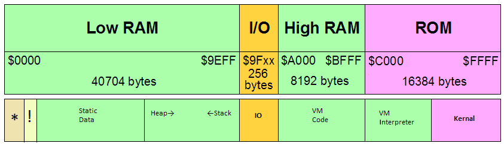

# Sample Virtual Machine Layouts (WIP)

## Contents

* [Overview](#overview)
* [1A Low Ram](#1a-low-ram)
   * [1B Low Ram plus Flash](#1b-low-ram-plus-flash)
   * [1C Low Ram plus Flash Emulation](#1c-low-ram-plus-flash-emulation)
   * [1D Low Ram plus Dynamic](#1d-low-ram-plus-dynamic)
* [2A Banked Ram](#2a-banked-ram)
   * [2B Banked Ram plus Flash](#2b-banked-ram-plus-flash)
   * [2C Not an option](#2c-not-an-option)
   * [2D Banked Ram and Heap](#2d-banked-ram-and-heap)

## Overview

To review, this section will examine different VM layouts guided by the
following four questions:

1. Where in the system will the VM interpreter reside?
2. Where will the target program reside?
3. Where will the data, stack(s), and heap(s) reside?
4. How will I/O devices be supported?

## 1A Low Ram

This option is the simplest and the easiest to implement. It basically puts
everything into the 40K low ram region of memory. Here's what it looks like:

Regions:

1. __'\*'__ - The lowest 2K of memory are reserved for the zero and stack
pages plus six pages for the use of the BASIC interpreter.
2. **VM Interpreter** - The W65C02S code that interprets VM code.
3. **VM Code** - The VM code to be interpreted. AKA the application code.
4. **Static Data** - Global and static data of the interpreter and the
application. Not included here are the system stack and zero page variables.
5. **Heap** - This optional region is used for dynamic memory allocation,
assuming your VM supports that feature.
6. **Stack** - The generalized VM stack, assuming your VM supports that
feature.
7. **IO** - The page reserved for IO devices.
8. In grey - Unused regions.
9. The "**kernal**" in flash. The system BIOS.

As can be seen, all of the application is in low RAM. With 40K there's enough
here to get quite a bit of work done. This option keeps things simple with all
addresses being simple 16 values that map directly to native addresses. No
complexity or overhead to get in the way.

While special I/O instructions can be added for space savings and performance,
they are not strictly required as the ability to address the entire system
allows regular memory addresses to be used to control devices.

On the down side, this option is cramped for space. It ignores the largest
region of RAM, the high banked area and the empty banks of flash memory. The
40K (oops, 38K) of low RAM will get used up in a hurry.

Still, this is a great option for starting out. I highly recommend it.

### 1B Low Ram plus Flash

A slight variation of the Low Ram model above makes use of the empty language
flash memory banks to hold the VM interpreter. This frees up space in Low Ram
but adds a few new wrinkles:

Regions:

1. __'\*'__ - The lowest 2K of memory are reserved for the zero and stack
pages plus six pages for the use of the BASIC interpreter.
2. __'!'__ - The initial startup code that calls into the VM interpreter.
3. **VM Code** - The VM code to be interpreted. AKA the application code.
4. **Static Data** - Global and static data of the interpreter and the
application. Not included here are the system stack and zero page variables.
5. **Heap** - This optional region is used for dynamic memory allocation,
assuming your VM supports that feature.
6. **Stack** - The generalized VM stack, assuming your VM supports that
feature.
7. **IO** - The page reserved for IO devices.
8. In grey - Unused regions.
9. **VM Interpreter** - The W65C02S code that interprets VM code.
10. The "**kernal**" in flash. The system BIOS.

This layout preserves the advantages of the previous with simple, uniform
16-bit addresses with the added advantage of saving up to 8K of precious low
ram.

Complications here are the task of getting the required code into the required
bank of flash memory. Would the bank of flash be static or dynamic? In which
case we have to search through the banks looking for the correct one?
Currently all of this is solidly TBD.

Another potential problem is that the VM interpreter now needs to be less than
8K in length. This is probably not a problem but one can never be too certain
of that.

### 1C Low Ram plus Flash Emulation

On a variation of the variation, this Low Ram model puts the VM interpreter
into an unused bank of the High Ram. In effect, the High Ram is being used to
emulate what the flash would have done. The map is very similar:

Regions:

1. __'\*'__ - The lowest 2K of memory are reserved for the zero and stack
pages plus six pages for the use of the BASIC interpreter.
2. __'!'__ - The initial startup code that calls into the VM interpreter.
3. **VM Code** - The VM code to be interpreted. AKA the application code.
4. **Static Data** - Global and static data of the interpreter and the
application. Not included here are the system stack and zero page variables.
5. **Heap** - This optional region is used for dynamic memory allocation,
assuming your VM supports that feature.
6. **Stack** - The generalized VM stack, assuming your VM supports that
feature.
7. **IO** - The page reserved for IO devices.
8. **VM Interpreter** - The W65C02S code that interprets VM code, located in
a single bank of the High Ram.
9. In grey - Unused regions.
10. The "**kernal**" in flash. The system BIOS.

This layout also preserves the advantages of the simple, uniform
16-bit addresses and the added advantage of saving up to 8K of precious low
ram.

It also adds the require to explicitly load the VM interpreter into a bank.
This is less complex than loading it into flash, but would have to be done
every time the program was run. It would likely be part of the initial
startup code.

One potential downside is that if the file containing the VM interpreter
cannot be found, the program is unable to run and must exit with an error
message. Nobody likes error messages.

Plus, this option shares the 8K limit on the size of the VM interpreter.

### 1D Low Ram plus Dynamic

This option has a fancy name, but it really just a combination of options 1B
and 1C. Here, the startup code does a little more work. It first checks the
flash banks looking for the correct version of the VM interpreter. If it is
found, it uses that. If not found it loads the needed code into a ram bank and
uses that.

There's no map graphic to see here, they're above in sections 1B and 1C.

This approach allows for more flexible delivery of applications, but may
introduce a layer of complexity without much in the way of benefit.

## 2A Banked Ram

In this approach we mark a major departure by storing VM code in the multiple
banks of high ram, as shown here:

Regions:

1. __'\*'__ - The lowest 2K of memory are reserved for the zero and stack
pages plus six pages for the use of the BASIC interpreter.
2. **VM Interpreter** - The W65C02S code that interprets VM code.
3. **Static Data** - Global and static data of the interpreter and the
application. Not included here are the system stack and zero page variables.
4. **Heap** - This optional region is used for dynamic memory allocation,
assuming your VM supports that feature.
5. **Stack** - The generalized VM stack, assuming your VM supports that
feature.
6. **IO** - The page reserved for IO devices.
7. **VM Code** - The VM code to be interpreted, AKA the application code,
stored in one or more banks of the high ram.
8. In grey - Unused regions.
9. The "**kernal**" in flash. The system BIOS.

The big gain here is that our VM code is no longer constrained to fit into
the cramped 40K of low ram. However, this improvement comes at a steep price.
VM code addresses are no longer simple 16-bit native CPU addresses. They now
need to specify a bank number in addition to a 13 bit offset into that bank.
This makes the job of fetching instructions a lot more complicated.

And it means we have more questions to answer.

* How many banks do we want to use to hold our code? If this is 8 or less, we
can have up to 64K of VM code while still keeping our VM code addresses to 16
(mapped) bits. If more banks of code are used, then we can have even more VM
code, but our code addresses must now be at least 24 bits.
* Since there are different sorts of addresses, code and data, how will we
handle diverse address types? Like when they cross over with constant data
stored with code or function pointers stored as data?
* Do we want to create a universal pointer type that can point to anything?
And if so, how awful will the overhead (space and time) of those pointers be?

### 2B Banked Ram plus Flash

A slight variation of the Banked Ram model above makes use of the empty
language flash memory banks to hold the VM interpreter. As before, this frees
up space in Low Ram and adds a few new wrinkles:

Regions:

1. __'\*'__ - The lowest 2K of memory are reserved for the zero and stack
pages plus six pages for the use of the BASIC interpreter.
2. __'!'__ - The initial startup code that calls into the VM interpreter.
3. **Static Data** - Global and static data of the interpreter and the
application. Not included here are the system stack and zero page variables.
4. **Heap** - This optional region is used for dynamic memory allocation,
assuming your VM supports that feature.
5. **Stack** - The generalized VM stack, assuming your VM supports that
feature.
6. **IO** - The page reserved for IO devices.
7. **VM Code** - The VM code to be interpreted, AKA the application code,
stored in one or more banks of the high ram.
8. **VM Interpreter** - The W65C02S code that interprets VM code.
9. The "**kernal**" in flash. The system BIOS.

This layout does nothing to reduce the complexity of multiple address types,
but it still saves up to 8K of precious low ram.

It repeats the complications of option 1B, with the task of getting the
required code into the required bank of flash memory. Would the bank of flash
be static or dynamic? In which case we have to search through the banks
looking for the correct one? Currently all of this is solidly TBD.

Another potential problem is that the VM interpreter now needs to be less than
8K in length. This is probably not a problem but one can never be too certain
of that.

### 2C Not an option

In this spot, one would logically expect to see an option that puts the VM
interpreter into banked high ram. However, having both the interpreter and the
interpretee in banked ram is not a feasible option, so it is omitted except
for saying that it was omitted.

While it is possible to envision using a bank of high ram for less frequently
used, larger bits of code, such a discussion is outside the scope of this
design sampler. It is left as an exercise for the reader to study this idea
further.

### 2D Banked Ram and Heap

This option is identical to option 2A except that the heap has been moved into
banked ram along with the VM application code. If you are using a heap, this
opens up a lot more ram for use while freeing up still more low ram. Here it
is in all its glory:

Regions:

1. __'\*'__ - The lowest 2K of memory are reserved for the zero and stack
pages plus six pages for the use of the BASIC interpreter.
2. **VM Interpreter** - The W65C02S code that interprets VM code.
3. **Static Data** - Global and static data of the interpreter and the
application. Not included here are the system stack and zero page variables.
4. **Stack** - The generalized VM stack, assuming your VM supports that
feature.
5. **IO** - The page reserved for IO devices.
6. **VM Code** - The VM code to be interpreted, AKA the application code,
stored in one or more banks of the high ram.
7. **Heap** - This region is used for dynamic memory allocation,
assuming your VM supports that feature.
8. The "**kernal**" in flash. The system BIOS.

On the plus side, moving the heap to banked high ram save somes low ram. On the
other hand we now have to deal with yet another kind of address, the banked
data address. This adds more complexity, but now we can have much larger heaps
than before.
