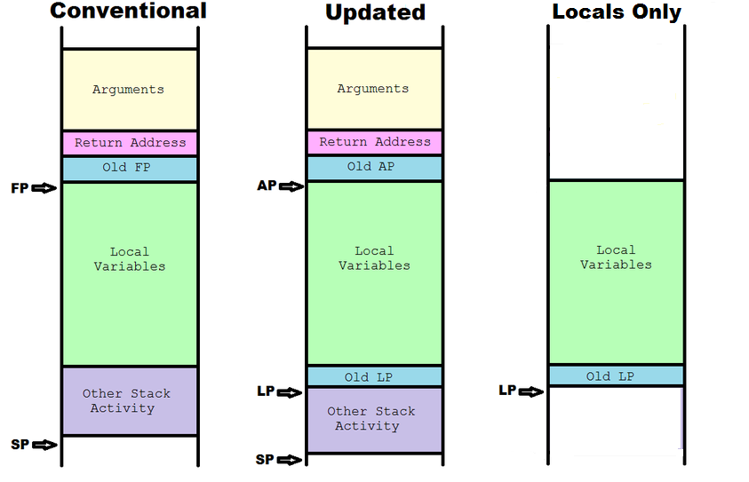

# Implementing VM Stacks

[Back to Virtual Machines](./virtual_machines.md)

## Contents

* [Introduction](#introduction)
* [Stack Options](#stack-options)
   * [The System Stack](#the-system-stack)
   * [The Absolute Indexed Stack](#the-absolute-indexed-stack)
   * [The Zippy Stack](#the-zippy-stack)
   * [The Page Stack](#the-page-stack)
   * [The Large Stack](#the-large-stack)
      * [Stack Frames](#stack-frames)
      * [Enter and Exit](#enter-and-exit)
      * [Accessing Locals](#accessing-locals)
* [Macro Abstraction](#macro-abstraction)

## Introduction

This section will focus on the options available for providing stack support.
This means test cases will be designed with the goal of making the best use
of the limited resources of the W65C02S. Studies will note the resources of
memory and clock cycles used by each design.

To compare the designs, the following uses for stacks are examined:

1. Holding subroutine return addresses.
2. Passing parameters to a function or procedure.
3. Accessing parameters to this function or procedure.
4. Setting the return value for this function.
5. Getting return values back from functions.
6. Allocation of local variables.
7. Accessing those local variables.
8. Preserving native registers and variables when necessary for internal
virtual machine code.

[Back to the Top](#implementing-vm-stacks)

## Stack Options

In this section, let's take a look at the sorts of stacks available for use.
In very general terms these fall into one of two camps:

* Small stacks of 256 bytes or less.
* Larger stacks with no 256 byte size limit.

Now let's look at what low level operations fit our use cases:

* Pushing data onto the stack.
* Popping data from the stack.
* Creating stack frames.
* Destroying stack frames.
* Accessing data in the frame using a frame pointer and an
offset.
* Performing arithmetic and logic operations on stack data.

And as if that weren't enough there are still more considerations:

* Are there any special alignment requirements to use the stack?
* Can the stacks be moved around for efficient multi-threading?
* Can the stack share space with a heap to support dynamic memory allocation?
* When we index from the stack pointer, does the offset value need to be
signed, or can we make do with an unsigned offset?
* Can we divide the tasks of our stack into multiple stack types, each better
suited to the tasks assigned to it?

There are actually a lot of variations of the code that can be used to
implement the functionality of a stack. The following sections examine a
few of these possibilities:

[Back to the Top](#implementing-vm-stacks)

### The System Stack

The W65C02S stack pointer (S) is used to provide a small stack (256 bytes)
with a fixed location in memory page 1. It is reasonably good at pushing and
popping data, especially with the enhanced instruction set of the CMOS
version of the chip:

```
  php                    ; Push the processor status register.
  phy                    ; Push Y (Enhancement)
  phx                    ; Push X (Enhancement)
  pha                    ; Push A

  pla                    ; Pull A
  plx                    ; Pull X (Enhancement)
  ply                    ; Pull Y (Enhancement)
  plp                    ; Pull the processor status register.
```

No other operations are available for data on the stack. In particular it is
not possible to use the S register in any sort of indexed addressing mode. It
is possible to simulate this however, as shown in this example:

```
  ; Add the last two bytes pushed onto the stack.
  pla                    ; Get the last byte pushed
  tsx                    ; X mirrors S
  clc                    ; Prepare to add.
  adc $101,x             ; Add in the byte above.
  sta $101,x             ; Save result.
```

While the system stack is well suited to the task of pushing and pulling
values, it's small size makes it unsuitable for holding stack frames. It is
a candidate for use as an evaluation stack, but again, its small size can
make things a bit cramped. It is fixed in page 1, meaning that multi-threading
systems are forced to carve up the tiny space available, or a lot of data
needs to be copied to move stacks.

Notes:
* The system stack is naturally page aligned in page 1.
* The pull instructions all modify the P register. So in any sequence
that seeks to preserve that register, the _plp_ instruction must be the last
one in the sequence. One such sequence is shown above.
* In addition, since the system stack is used during interrupt processing, no
data should ever be placed or accessed from addresses less than the address
$101 + S.

[Back to the Top](#implementing-vm-stacks)

### The Absolute Indexed Stack

This type of stack uses one of the index registers (X or Y) along with an
absolute base to simulate stack behavior. Let's see what's involved with
push and pull:

```
  ; ais_pha
  sta stack_base,x       ; Write the data.
  dex                    ; Adjust the stack pointer.

  ; ais_pla
  inx                    ; Adjust the stack pointer.
  lda stack_base,x       ; Read the data.
```

This type of stack also allows for other operations beyond the basic push
and pull, though the X register has a richer set than the Y register.

```
  ; Add the last two bytes pushed onto the stack.
  clc                    ; Prepare to add.
  lda stack_base+1,x     ; Get the last byte pushed
  adc stack_base+2,x     ; Add in the byte above.
  sta stack_base+2,x     ; Save result.
  inx
```

A useful feature of this type of stack is the ease of accessing different
parts of the stack by using an offset value added to the stack base address.

Like the system stack, this is well suited to the task of pushing and pulling
data, and the evaluation of expressions. However, it's small size makes it
unsuitable for holding stack frames. Since its base address is fixed,
multi-threading systems are forced to either carve up the tiny space
available, or a lot of data needs to be copied to move stacks.

Notes:
* This type of stack may be used to create stacks from 2 up to a limit of 256
bytes.
* Stack space does not need to be page aligned, however, it will run faster
if it does not cross a page boundary.
* Since this stack uses an index register, the overhead of saving and
restoring that register needs to be factored in.
* For a stack of size L bytes, the initial stack pointer value is L-1.
* These stacks are not interrupt safe.

[Back to the Top](#implementing-vm-stacks)

### The Zippy Stack

This stack is based on the Zero Page Indirect Indexed with Y (zpy) addressing
mode. These stacks are similar to the absolute indexed stacks above except
that they require 2 bytes of zero page storage for the base pointer, generally
have slightly shorter code and consume more clock cycles. the are also
limited to the Y register and a restricted set of 8 instructions.

Also like the absolute indexed stacks, these are small stacks that use an
index register (Y).

Lets see push and pull:

```
  ; zippy_pha
  sta (stack_base),y     ; Write the data.
  dey                    ; Adjust the stack pointer.

  ; zippy_pla
  iny                    ; Adjust the stack pointer.
  lda (stack_base),y     ; Read the data.
```

While not as versatile as the X register, data manipulation is still
effective for these sorts of stacks:

```
  ; Add the last two bytes pushed onto the stack.
  clc                    ; Prepare to add.
  iny
  lda (stack_base),y     ; Get the last byte pushed
  iny
  adc (stack_base),y     ; Add in the byte above.
  sta (stack_base),y     ; Save result.
  dey
```

Notes:
* This type of stack may also be used to create stacks from 2 up to a limit
of 256 bytes.
* Stack space does not need to be page aligned. Further it will not run
faster if it does not cross a page boundary.
* Since this stack uses an index register, the overhead of saving and
restoring that register needs to be factored in.
* Since its base address is not fixed, multi-threading systems can easily
switch between multiple stacks.
* For a stack of size L bytes, the initial stack pointer value is L-1.
* These stacks are not interrupt safe.

[Back to the Top](#implementing-vm-stacks)

### The Page Stack

The page stack is yet another small stack based (predominantly) on the new
W65C02S addressing mode, zero page indirect. The concept is that of a page
aligned stack, access via an indirect pointer, where the upper 8 bits of the
address do not change. Only the lower 8 bits of the address are adjusted
as needed.

Lets see push and pull:

```
  ; page_pha
  sta (stack_base)       ; Write the data.
  dec stack_base         ; Adjust the stack pointer.

  ; page_pla
  inc stack_base         ; Adjust the stack pointer.
  lda (stack_base)       ; Read the data.
```

While limited in instructions available, data manipulation is still
effective for these sorts of stacks:

```
  ; Add the last two bytes pushed onto the stack.
  clc                    ; Prepare to add.
  ldy #1                 ; Use Y for offsets.
  lda (stack_base),y     ; Get the last byte pushed
  iny
  adc (stack_base),y     ; Add in the byte above.
  sta (stack_base),y     ; Save result.
  inc stack_base         ; Adjust the stack pointer.
```

Notes:
* Stack space needs to be page aligned.
* Since its base address is not fixed, multi-threading systems can easily
switch between multiple stacks.
* Since this stack occupies a page, the initial value of the low byte is $FF.
* No index registers are occupied by the operation of this stack.
* The Y register can be used to provide offsets to the stack pointer.
* These stacks are not interrupt safe.

[Back to the Top](#implementing-vm-stacks)

### The Large Stack

The large stack is similar to the page stack except that the full 16 bit
address is updated for each operation. This allows this stack to, for the
first time, exceed the 256 byte limit of all those small stacks. This comes
at a price though in terms of larger code and lower performance. To
start off, lets examine push and pull:

```
  ; vm_ls_pha_f
  sta (stack_base)       ; Write the data.
  lda stack_base         ; Adjust the stack pointer.
  bne :+
  dec stack_base+1
: dec stack_base

  ; vm_ls_pla_f
  inc stack_base         ; Adjust the stack pointer.
  bne :+
  inc stack_base+1
: lda (stack_base)       ; Read the data.
```

Since we will need this data later, these routines consume 10 bytes and 16
clocks and 8 bytes and 13 clocks respectively. The space saving versions both
use 3 bytes of space and 20 and 25 clocks cycles.

Data manipulation is not really effective for these sorts of stacks, but it
can be made to work after a fashion:

```
  ; Add the last two bytes pushed onto the stack.
  clc                    ; Prepare to add.
  ldy #1                 ; Use Y for offsets.
  lda (stack_base),y     ; Get the last byte pushed
  iny
  adc (stack_base),y     ; Add in the byte above.
  sta (stack_base),y     ; Save result.
  inc stack_base         ; Adjust the stack pointer.
  bne :+
  inc stack_base+1
:
```

[Back to the Top](#implementing-vm-stacks)

#### Stack Frames

Finally, with a stack able to break the 256 byte barrier, we come to stack
frames. In classic compiler design, the stack frame is the foundation of the
single most important language activity: calling functions. This, in turn,
adds the need to support arguments, local variables, and return values.

In modern compilers, the stack frame is less prominent, being supplanted by
sophisticated compilers that are able to use modern processors with large
numbers of registers to achieve high levels of efficiency. With the W65C02S,
we have neither the registers not the sophisticated compiler. We must use
a stack frame to make things work.

Below are the classic stack frame, and two models of modified stack
frame designs:



The classic design does it all with only a single frame pointer (FP) register.
This model runs into problems with the W65C02S processor:

1. Except for branch instructions, negative offsets are not supported at all.
While they could be emulated, they would be extremely slow and bulky.
2. When it does support offsets, they are only 8-bit long.

To alleviate these issues, the updated design splits the FP register into two
registers, each with part of the duties of the original. The Argument Pointer
(AP) is responsible for pointing to the arguments of the function and serving
as an anchor for the unwinding process when it come time to exit the function.
This is very similar to the classic FP. The second pointer is the Locals
Pointer that takes on the task of addressing local variables. Due to its
location at the bottom of that region, it only needs positive offsets. Further
since that is almost all it does, it can make up to 254 bytes of local space
available.

However, as we will soon see, this updated design is very costly in terms of
the resources needed to create and destroy frames. The third design, Locals
Only strips the frame to the minimum by just supporting local variables. Does
this really help?

[Back to the Top](#implementing-vm-stacks)

### Enter and Exit

The enter and exit operations are responsible for creating and destroying
stack frames respectively. Since they will be needed for almost every
function they have a significant impact on performance. First we examine
the enter command:

```
  lda vm_ap+1            ; Save the vm_ap
  vm_fs_pha_f
  lda vm_ap
  vm_fs_pha_f

  lds vm_fa              ; vm_ap = vm_fs
  sta vm_ap
  lds vm_fa+1
  sta vm_ap+1

  vm_fetch_f             ; Get (local_size + 2) xor $FF

  sec                    ; vm_fs = ((local_size + 2) xor $FFFF) + vm_fs + 1
  adc vm_fs
  sta vm_fs
  lda #$FF
  adc vm_fs+1
  sta vm_fs+1

  ldy #$01               ; Save vm_lp
  lda vm_lp
  sta (vm_fs),y
  iny
  lda vm_lp+1
  sta (vm_fs),y

  lds vm_fa              ; vm_lp = vm_fs
  sta vm_lp
  lds vm_fa+1
  sta vm_lp+1
```

This consumes 70 bytes and 99 clock cycles. Note that this code supports up
to 253 bytes of local variable space. And then we look at exit:

```
  ldy #$01               ; Restore old vm_lp
  lda (vm_lp),y
  tax
  iny
  lda (vm_lp),y
  sta vm_lp+1
  stx vm_lp

  lda vm_ap              ; vm_fs := vm_ap
  sta vm_fs
  lda vm_ap+1
  sta vm_fs+1

  vm_fs_pla_f            ; Restore old vm_ap
  sta vm_ap
  vm_fs_pla_f
  sta vm_ap+1
```

And this consumes 40 bytes and 66 clock cycles. Clearly these two operations
exact a heavy toll, both in terms of space and time. Are they worth it? They
do provide a unified, coherent function frame with all the "fixins", so maybe
that's OK?

So what if we curb our enthusiasm and keep things simpler? Let's see our two
crucial routines for the "locals only" frame design:

```
  lda vm_lp              ; vm_t = vm_lp
  sta vm_t
  lda vm_lp+1
  sta vm_t+1

  vm_fetch_f             ; Get (local_size + 2) xor $FF

  sec                    ; vm_lp = ((local_size + 2) xor $FFFF) + vm_lp + 1
  adc vm_lp
  sta vm_lp
  lda #$FF
  adc vm_lp+1
  sta vm_lp+1

  ldy #$01               ; Save vm_t
  lda vm_t
  sta (vm_lp),y
  iny
  lda vm_t+1
  sta (vm_fs),y
```

Now this consumes 38 bytes and 59 clock cycles. And then we look at exit:

```
  ldy #$01               ; Restore old vm_lp
  lda (vm_lp),y
  tax
  iny
  lda (vm_lp),y
  sta vm_lp+1
  stx vm_lp
```

And this consumes 12 bytes and 22 clock cycles. While not zippy, these
versions of _enter_ and _exit_ are much leaner in space and time.

[Back to the Top](#implementing-vm-stacks)

### Accessing Locals

After space for local variables has been allocated, the next step is to
access the data itself. Note that this code assumes that it is OK to clobber
the Y register. If this is not the case, additional code to save and restore
the Y register will need to be added. We start with a simple fetch of a byte.
The code to store a byte is nearly identical and so is left as an exercise
for the reader.

```
  vm_fetch_f             ; Get the variable offset + 2
  tay
  lda (vm_lp),y          ; Get the local data byte.
```

This code consumes 11 bytes and 20 clock cycles. Furthermore, it is expected
that the data retrieved would normally be stored someplace. Examples include
a VM register or the evaluation stack. The code for this is strongly
determined by the VM architecture and is also left to the reader.

Another task that will come up is computing the address of a local variable
so that a reference to it can be passed as a parameter.

```
  vm_fetch_f             ; Get the variable offset + 2
  clc                    ; Compute vm_lp + offset
  adc vm_lp
  sta vm_t
  lda #$00
  adc vm_lp+1
  sta vm_t+1
```

This uses 19 bytes and 29 clock cycles. It stores the effective address
into _vm\_t_, but actual code may need the result to be elsewhere.

[Back to the Top](#implementing-vm-stacks)

Notes:
* Stack space does not need to be page aligned.
* Since its base address is not fixed, multi-threading systems can easily
switch between multiple stacks.
* The initial value of the stack pointer is the address of the last byte of
memory in the stack area.
* No index registers are occupied by the operation of this stack.
* The Y register can be used to provide offsets to the stack pointer.
* These stacks are not interrupt safe.

[Back to the Top](#implementing-vm-stacks)

## Macro Abstraction

The use of stacks is another area that can benefit from decoupling. The
abstraction of stacks is much more complex than that of the instruction
pointer. There are more operations and more than one class of stack. That
is why this rather longer list of macros was devised:

```
vm_pha_as_f        ; Push A onto the argument stack, emphasis on being fast.
vm_pha_as_s        ; Push A onto the argument stack, emphasis on saving space.
vm_pla_as_f        ; Pull A from the argument stack, emphasis on being fast.
vm_pla_as_s        ; Pull A from the argument stack, emphasis on saving space.

vm_pha_es_f        ; Push A onto the evaluation stack, emphasis on being fast.
vm_pha_es_s        ; Push A onto the evaluation stack, emphasis on saving space.
vm_pla_es_f        ; Pull A from the evaluation stack, emphasis on being fast.
vm_pla_es_s        ; Pull A from the evaluation stack, emphasis on saving space.

vm_pha_fs_f        ; Push A onto the frame stack, emphasis on being fast.
vm_pha_fs_s        ; Push A onto the frame stack, emphasis on saving space.
vm_pla_fs_f        ; Pull A from the frame stack, emphasis on being fast.
vm_pla_fs_s        ; Pull A from the frame stack, emphasis on saving space.

vm_pha_rs_f        ; Push A onto the return stack, emphasis on being fast.
vm_pha_rs_s        ; Push A onto the return stack, emphasis on saving space.
vm_pla_rs_f        ; Pull A from the return stack, emphasis on being fast.
vm_pla_rs_s        ; Pull A from the return stack, emphasis on saving space.
```

Again, some of these operations may generate the same code, and since some
stack responsibilities may be merged, transfers between stacks may not be
robust to changes in system design.

wip

[Back to the Top](#implementing-vm-stacks)
