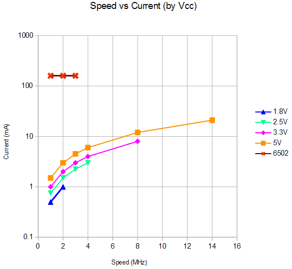

# What's "New" in the W65C02S?

The first question that arises is exactly what processor chips are we going to
compare? It turns out that there have been a lot of old-school NMOS 6502 chips
through the years as well as quite a few parts called W65C02S. We can however
simplify things be specifying that we will look at the classic 6502 produced
by MOS TECH and the W65C02S made by WDC and planned for the Commander X 16
project. Other parts are not relevant to this study.

The comparison will be made on the basis of the hardware and software
differences between the chips with an emphasis on those factors that affect
the Commander X 16 project. For a closer look at the technologies used in
these devices, see a [**deep dive**](./process.md).

## Programming

### New Instructions

The W65C02S adds new instructions and adds addressing modes that were absent
from some existing instructions. Here's a summary:

Instruction | New Modes                | Description
------------|--------------------------|--------------
_adc_       | (zp)                     | A &larr; A + m + cy. Added mode.
_and_       | (zp)                     | A &larr; A &and; m. Added mode.
_bbr_       | zp+pcr                   | Branch relative if bit cleared.
_bbs_       | zp+pcr                   | Branch relative if bit set.
_bit_       | imm, {abs,x}, {zp,x}     | A &and; m. Added 3 modes.
_bra_       | pcr                      | Branch always.
_cmp_       | (zp)                     | A - m. Added mode.
_dec_       | inh                      | m = m - 1. Added mode to allow _dec A_.
_eor_       | (zp)                     | A &larr; a &#x22BB; m. Added mode.
_inc_       | inh                      | m = m + 1. Added mode to allow _inc A_.
_jmp_       | (abs,x)                  | Jump to m. Added mode.
_lda_       | (zp)                     | A &larr; m. Added mode.
_ora_       | (zp)                     | A &larr; A &or; m. Added mode.
_phx_       | stack                    | Push X onto the stack.
_phy_       | stack                    | Push Y onto the stack.
_plx_       | stack                    | Pull X from the stack.
_ply_       | stack                    | Pull Y from the stack.
_sbc_       | (zp)                     | A &larr; A + ~m + cy. Added mode.
_sta_       | (zp)                     | m &larr; A. Added mode.
_stp_       | inh                      | Stop the processor.
_stx_       | abs, zp, {abs,x}, {zp,x} | m &larr; 0. Store 0 into memory.
_trb_       | abs, zp                  | Test for (A &and; m) = 0. m &larr; ~A &and; m.
_tsb_       | abs, zp                  | Test for (A &and; m) = 0. m &larr; A &or; m.
_wai_       | inh                      | Wait for an interrupt.

### New Addressing Modes

The W65C02S adds three entirely new addressing modes. Further, it enhances a
number of instructions by adding in addressing modes that were omitted in the
6502.

wip

### Bug Fixes

The W65C02S corrects the following issues with the 6502:

#### Illegal Instructions

The 6502 defined 151 valid operational codes. This left 105 unused opcodes
which had undefined behavior. Some of these did interesting things and some
caused the process to stop working so badly that only a reset would restore
order. A watch-dog timer connected to the NMI line would not work.

In the W65C02S, many of these codes are now defined with new uses. Moreover,
the remaining undefined codes perform no-operation and are reserved for
future use. No processor hangs, no interesting mash-ups. Sometimes boring
_is_ better.

#### The _jmp_ Instruction

The 6502 allows the _jmp_ instruction to use a fully indirect addressing mode.
In that mode, the instruction contains a 16 bit address. This points to the
first of two bytes that contain the target address of the _jmp_. The problem
is that if a page boundary separates the two target bytes, the wrong second
byte will be fetched and the processor will jump incorrectly.

The W65C02S simply fixes the bug and fetches the correct data. No bug.

#### Indexed Addressing

When the 6502 accessed data using an indexed addressing, an issue could occur
if the result of the address calculation crossed a page boundary. If that
happened, an read to an invalid address could occur. Normally with RAM or ROM,
such "extra" reads are harmless. With I/O devices however, this could result
in lost data as data could be removed from buffers and discarded.

The W65C02S avoids this by performing an extra read of last instruction byte
instead.

While on the topic of spurious memory cycles, Read/Modify/Write (_asl_, _dec_,
_inc_, _lsr_, _rol_, _ror_, _trb_, and _tsb_) instructions still perform an
"extra" read of the target address. This is a lot better than the 6502 which
performed an "extra" write of the target address. The situation is better but
it may be prudent to avoid such instructions when accessing I/O devices.

We can call this a partial fix then.

#### The _brk_ Instruction

When an interrupt occurs immediately after the fetch of a BRK instruction on
the 6502, the BRK is ignored. On the W65C02S, the BRK is executed, then the
interrupt is executed. No instruction intent is lost. Interrupts and the _brk_
instruction can now be used together without fear of catastrophe.

#### Decimal Mode

The D flag controls the decimal mode of the processor. When enabled,
arithmetic is performed using Binary Coded Decimal (BCD) rules. After a
reset or an interrupt, the state of the D flag is unknown and it must be
set (or more likely cleared) to place the processor in a known state. This is
less a bug and more an annoyance.

Further, the negative, overflow, and zero flags in the status register are not
set correctly in decimal mode. Darn!

In the W65C02S, the D flag is cleared after reset or an interrupt and the
negative, overflow, and zero flags are set correctly while in decimal mode.
I already feel less annoyed.

## Hardware

### Compatibility

Here's a common myth: "The 65C02 is a fully pin compatible, drop-in replacement
for the 6502". Here's a look at some device pin-outs with differences
highlighted in bold:

Myth BUSTED! Not only are five pins different between the two chips, at least
one pin is seriously incompatible. Let's examine these in detail, sorted by
level of severity:

#### Pin 1

This is the serious case. Let's examine the scenario where a W65C02S is
plugged into a socket that was originally designed for a 6502.

On the 6502, pin 1 is a Vss or Ground pin. As such it would normally be
connected to the Ground line of the printed circuit board (PCB). Even in older
designs where the PCB had only two layers, the Ground line would normally be
a more robust connection to be able to handle a large amount of current. In
more modern designs with four (or more) layers, an entire layer, consisting of
essentially a full sheet of copper would be used for Ground. This Ground layer
(or Ground plane as it often called) can handle large current flows with
negligible resistance to that current flow.

On the W65C02S, pin 1 is the Vector Pull line. The W65C02S data sheet says
of this line that:

_VPB is low during during the last interrupt sequence cycles, during which
time the processor reads the interrupt vector_

Now when Vector Pull is low there is no issue. A pin is driving low to a PCB
where it is hardwired low. When the pin tries to return to a high state is
another matter. A transistor in the chip attempts to raise the pin to a one
or high voltage state. The PCB is having none of that. It sinks all the
current it needs to to keep the pin low. As a result, a great deal of current
flows through the pin and the transistor connected to it. This can damage
the chip and cause it to stop working reliably. Bad news!

##### Fixes

* If the PCB does not ground pin 1, then there is no problem.
* Otherwise, you can bend out pin 1 so it does not connect with the socket.
* If you have soldered directly to the PCB, you can cut off pin 1 with a
pair of side-edge cutters.
* If you don't want to mangle your W65C02S you can mount it in a socket where
pin 1 has been removed and plug that socket into the PCB socket.

#### Pin 36

This one _may_ cause trouble. The data sheets are lacking in enough detail
to be absolutely certain.

In the 6502, pin 36 is a No Connect pin. It would be expected that a 6502
PCB would have no connection for this pin.

In the W65C02S, pin 36 is the Bus Enable pin. When high, the address, data, and
control lines act normally. When low, those pins are disabled, allowing
another device to control those signals. The W65C02S data sheet clearly states
that unused input pins need to be connected to Vdd, the power pin.

##### Fixes

* Bodge a 10K&Omega; resistor directly to the chip between pins 36 and 8. This
will require some delicate soldering and will look ugly.
* Bodge a 10K&Omega; resistor to the underside of the PCB. This will hide the
resistor but you will have to deal with the mirror image problem and be
careful that you get the correct pins.

#### Pin 5

On the 6502, pin 5 is a No Connect pin. On the W65C02S it is an output, Memory
Lock, used to control access to memory when multiple CPUs are involved.

So long as the 6502 PCB respects the No Connect, this one should be fine.

#### Pin 37

On the 6502, pin 37 is the &Phi;0 input pin. On the W65C02S it's the &Phi;2
input pin. While this sounds serious, in most cases, at the low speeds of
older 6502 PCBs, the difference should not matter. The later section on
clocking looks into more detail of changes that are needed at higher speeds.

#### Pin 2

On both the 6502 and the W65C02S, pin 2 is used as the Ready line. It is most
often used as an input, usually held high because it is not being used. On
the W65C02S it can sometimes be used as an output. This occurs during execution
of the new Wait for an Interrupt (WAI) instruction. Another change made in
the C chip is that this pin no longer has an internal _pullup_. This means
that an older PCB may treat pin 2 as a no connect. In that case, we would
need to resort to a bodge resistor, like the one for pin 36, except between
pins 2 and 8.

#### References

Further information about using the W65C02S in older 6502 based systems can be
found [**here**](https://www.westerndesigncenter.com/wdc/AN-002_W65C02S_Replacements.cfm).

### Power Supply

The original 6502 requires a tightly regulated power supply of 5 volts
&plusmn;5% or from 4.75 to 5.25 volts.

The CMOS W65C02S is specified over the much larger range of 1.71 to 5.25
volts. This means that in some designs, the processor can be run directly
from unregulated batteries.

#### Voltage and Speed

The flexible W65C02S allows for lower voltages when the processor is operated
at a lower frequency. This chart shows the relationship between voltage and
speed:

#### Current and Speed

In the 6502, current consumption remained fairly constant (and high) regardless
of the frequency of the system clock. With the W65C02S, reduced frequency
and voltage also result in reduced current. This translates to a reduction
in overall energy consumption. The usage of current are shown below.

### Clocking

When the 6502 was first created, oscillator modules were very rare and costly.
As a result, the chip was designed to create it's own clock signals with the
help of a little external circuitry and tuned by a component simply called
a crystal. There were a number of circuits depending on the type of crystal
(if any) used in the design. Here is one:

One thing to bear in mind is that such oscillator circuits can be very
difficult to make reliable and can often be what engineers call "twitchy" or
"flaky".

Th W65C02S exists in an era where reliable oscillator modules are plentiful,
simple, reliable, and low cost. While the circuitry needed to create a 6502
style oscillator still exists, such an approach is unsuited to the demands
of higher frequency clock rates. As a result, the data sheet now states:

"_PHI1O and PHI2O clock delay from PHI2 is no longer specified or tested and
WDC recommends using an oscillator for system time base and PHI2 processor
input clock._"

There's no point putting a schematic here. It's too simple. The output of the
oscillator module connects to the &Phi;2 input pin. The module is also the
source of the clock for other devices in the system that require a clock
input.
