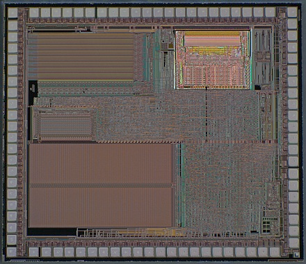
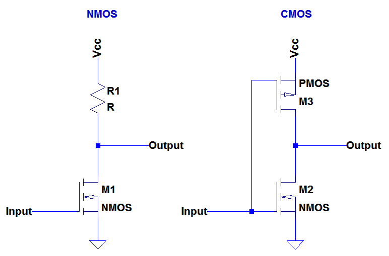

# Chip Process: NMOS vs CMOS (Optional)

A lot of the differences between the 6502 and the W65C02S come down to the
process used to create the chips. This document will take a simplified look
at how these design features make a dramatic impact on the resulting chips.

The original 6502 was an NMOS device with features sized at the 8 &mu;m with
an advertised die size of 3.9 mm &times; 4.3 mm, or an area of 16.6 mm&sup2;
The layout of the chip, its transistors, its interconnect wiring and its
internal registers were all drawn by hand on a huge six layered drawing.
Initially speeds were restricted to 1 MHz, but eventually, parts were
produced as fast as 4 MHz. All of these devices are designed to operate
with a 5 volt power supply.

The W65C02S is a CMOS device based on designs from WDC. WDC is a fabless
chip maker that designs chips but has no manufacturing facilities of its
own. Actual chips are available as are IP models based on
[GDSII](https://en.wikipedia.org/wiki/GDSII)
Hard Cores and
[Verilog](https://en.wikipedia.org/wiki/Verilog)
RTL Soft Cores. Given the wide range of implementation options available, no
one process geometry or die size can be ascertained for the part, beyond
vague references citing that it has a "small" die. Below is a System On a
Chip (SOC) most likely incorporating a GDSII core. The 65C02 core is just the
small highlighted region of the larger system chip design:

## NMOS vs CMOS

The way in which the lowest level logic of a chip are implemented, has a huge
impact on the way that chip behaves. Let's start by taking a look at the
circuit diagram of a simple NOT gate in both NMOS and CMOS:

Let me start be saying that these are highly simplified. For example the
resistor (R1) shown in the NMOS case is in fact a transistor. However, it is
wired up in such a way that it _acts_ just like a resistor. So how do these
design choices affect the behavior of the resultant chip?

Consider the NMOS design. The transistor, M1 can either be on or off. If it
is off, no current flows and the output is high (a one). If it is on, current
flows and the output is low (a zero). The current consumed is a function of
the number of ones and zeros in the system. Since, on average, these balance
out, the current takes on a fairly constant value. Further, given that a
substantial amount of current must flow through the resistor, this level of
current will in fact be fairly high. Now a small amount of current must flow
to charge or discharge the gate of M1, but this amount is small enough to
have little impact on the total current.

The tricky trade-off in this design is the selection of the resistor value.
In order to pass signals quickly, a lower resistance is favored as this will
supply more current to subsequent stages, overcoming circuit capacitance in
less time. In order to save power, a higher resistance is favored so that
when M1 is turned on, less current will be wasted flowing through R1.

In the CMOS design, when M2 is on, M3 is off and the output is low (a zero)
and when M2 is off, M3 is on and the output is high (a one). There is never
a direct current path through the gate. The static current draw is essentially
zero (excluding leakage currents) whether the output is zero or one. The only
current flow left is the current is needed to charge or discharge the gates
of M2 and M3.

In effect, the "dumb" resistor (R1) has been replaced with a "smart" switch
(M3) that can deliver a lot of current when it's needed while wasting no
current when it's not.

So what are the consequences of these choices. There quite a few actually.

### Supply Voltage and Power Consumption

Since the NMOS design relies on the current flow through a resistor, and that
flow highly sensitive to the supply voltage, NMOS devices only operate over
a narrow voltage range. The 6502 is specified for 5 volts &plusmn;5% or from
4.75 to 5.25 volts.

The CMOS design never lets current flow through a load resistor. The power
supply voltage only needs to be enough to turn on the gates of the
transistors while not being so high as to risk damaging the gates of those
transistors. Thus the CMOS W65C02S is specified over the much larger range
of 1.71 to 5.25 volts. Further, since lower voltages mean that the gates
of the transistors are charged "up" to a lower voltage too, lower supply
voltages result in a savings in current too.

This is so dramatic, it's worth seeing this chart again:

Due to the large range of current values that need to be represented, the
chart uses a logarithmic scale for the current. You can see how the vertical
axis labels increase by a factor of ten with each step. This really shows how
the old school 6502 uses a lot more current (and thus power) than the newer
W65C02S.

### Parting Thoughts

On a historical note, one may ask why the original 6502 did not use a CMOS
process. After all, it is not new and was in use at the time. However, it was
then much more expensive. Further, at that time, the CMOS process could only
achieve decent performance at much higher voltages, typically 12 volts. Five
volts had already been established as the de facto standard logic level for
most systems. These factors were severely at odds with the goal of producing
a low cost, high performance microprocessor. So the 6502 team went with NMOS
instead.

Finally, one last thought under the category of raw speed. WDC has reported
that FPGA realizations (most likely based on the Verilog models) of the
W65C02S have been successfully operated at 200 MHz. A whole new level of
performance for a very old processor architecture and a testament to the
longevity and growth potential of the original design.
