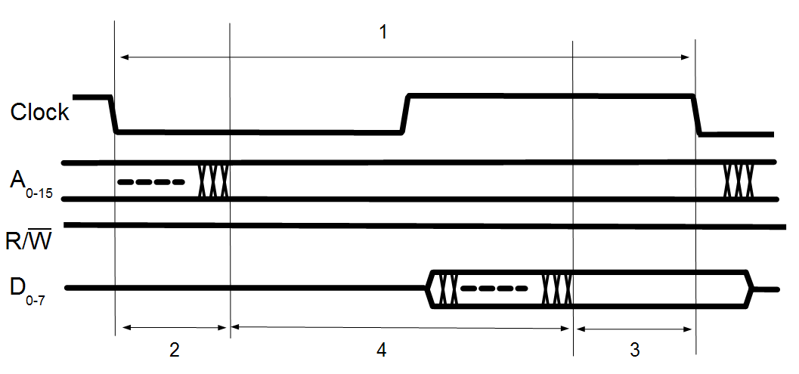
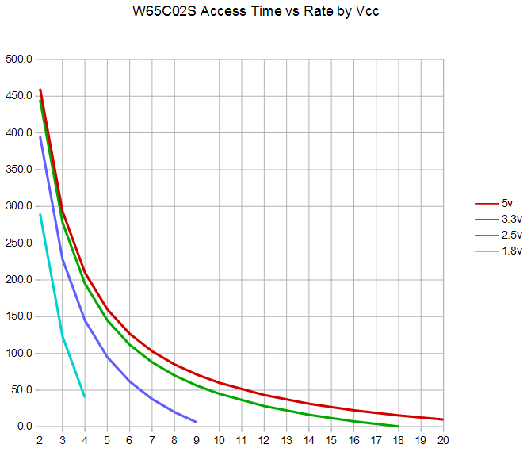

# Memory Speed Requirements

The W65C02S requires external memory to be useful. This memory can take the
form of volatile RAM, non-volatile ROM, or even peripheral devices mapped to
specific memory locations. Further it requires that this memory device (no
matter what kind of device it is) supply data in a timely manner. This
document examines the requirements that memory must meet to be compatible
with the CPU chip.

The following diagram illustrates a very simple system:

Now for our processor, the address consists of 16 address lines labeled A0
through A15. This 16 bit address can generate up to 65,536 unique addresses.
The command consists of a single line, R/W. When this line is low, a write
command is signified, when high, a read command is in progress. In this
design, the processor supplies the address and the command and the memory
returns the data for a read, or accepts the data for a write and that constitutes
a single memory transaction (AKA cycle).

Let's focus on read commands just for now.

## Memory Read Timing

This is a simplified version of the timing diagram that appears in the
data-sheet of the W65C02S.

As can be seen, four timing measurements are called out for examination. These
are:

| \#  | Parameter | Description
|:---:|:---------:|---------------------
| 1   |  tCYC     | The amount of time in each clock cycle.
| 2   |  tADS     | The address/command setup time.
| 3   |  tDSR     | The read data setup time.
| 4   |  tACC     | The memory access time.

Note that all times are normally specified in units of _nano-seconds_ or
0.000000001 seconds. Even in a retro computer, things happen pretty quickly.

So let's take a deeper look at these parameters.

### The Clock Cycle Time: tCYC

The tCYC is determined exclusively by the clock frequency that we have
selected for our computer. It is computed by the simple formula:

    tCYC (in seconds) is 1/frequency (in Hertz)

Now it is more convenient to specify frequency in Megahertz (MHz) and the time
in nano-seconds. factoring all that in we get:

    tCYC (in nano-seconds) is 1000/frequency (in Megahertz)

Some classic values are:

 F   |  tCYC   | Notes
:---:|:-------:|-------
 1   | 1000 ns | 1 MHz, the speed of the classic PET or Apple \]\[.
 2   |  500 ns | 2 Mhz, the speed of the prototype Commander X 16.
 4   |  250 ns | 4 Mhz, the classic top speed of the Z-80.
 8   |  125 ns | 8 Mhz, the target speed of the  Commander X 16.
 14  | 71.4 ns | 14 Mhz, the maximum speed of the W65C02S
 16  | 62.5 ns | 16 MHz, anyone for a little over-clocking?

Now the time of one clock cycle is the total amount of time available for a
memory cycle to complete its work. Everything must fit into that single time
parameter. Additional overheads deduct from this amount a result in the
memory needing to be even faster to keep things working.

### The Address/Command Setup Time: tADS

The memory cycle commences with the falling edge of the clock. That is why the
next signal, tADS is referenced from that clock edge to the time when the
address and control lines are known to be valid.

The tADS is surprisingly _not_ a function of the cycle time. Instead it is a
function of the internal delay of the circuits of the CPU. It turns out that
this delay is a function of the supply voltage. This is shown here.

 Vcc   | tADS
:-----:|-------
 5 V   | 30 ns
 3.3 V | 40 ns
 2.5 V | 70 ns
 1.8 V | 150 ns

 ### The Read Data Setup Time: tDSR

At the other end of the memory cycle, data is loaded into the processor by the
falling edg on the current memory cycle. Here too there is a timing
specification. The data must arrive a certain amount of time before the end
of the cycle to give it time to propagate into the internal circuitry of the
processor. Like tADS, tDSR is sensitive to supply voltage. Let's see:

 Vcc   | tDSR
:-----:|-------
 5 V   | 10 ns
 3.3 V | 15 ns
 2.5 V | 30 ns
 1.8 V | 60 ns

### The Memory Access Time: tACC

Finally we come to the memory access specification. This is not a
characteristic of the W65C02S. Rather is a requirement of the memory device,
that it must respond with valid data in tACC or less.

The tACC figure is a derived one. It uses this formula:

    tACC = tCYC - (tADS + tDSR)

Let's see tACC expressed in a cheerful little chart:

Now to be clear, this chart extrapolates clock frequencies to levels that may
be unreliable, but one can stick to the valid maximum values for each power
supply voltage.

One more point is that the access time is more than just the memory access
time. It must include the time needed for address decode circuitry to decide
which memory chip is being accessed, plus the time needed to transit any
data buffers, connectors, and the wires or PCB traces connecting them all.
The number of devices connected to the address and data buses, the inherent
pin capacitance of those devices, even the length of the circuit traces all
can slow down the transit of signals making the system marginal or
non-functional. I have seen no detailed schematics, but the Commander X 16
prototype seems to have a lot of devices connected and the large PCB means
that circuit traces will be long and most likely convoluted. Even the
preference for through hole parts versus surface mount is a factor as they
generally have higher package capacitances.

## Analysis

Computing the memory time budget can be a complex endeavor especially when the
system timing is tight due to high speed operation. This is why it is rare to
find W65C02S systems running at the full 14MHz.

So for example, when running at 14 MHz with a 5 volt supply, tACC is given by:

   tACC = 71.4 - (30 + 10) ns
        = 31.4 ns

That's just 31.4 ns to figure out which chip we want to access and get that
data to the processor. Now while SRAM chips are available down to as little
as 10 ns access times, Flash Memory chips seem to be, on the whole, slower.
I checked with my favored supplier, DigiKey. In the through-hole format
compatible with a socket, the fastest available device is only 70 ns. This
is far too slow for 14 MHz and "tight" even at 8 Mhz. Let's see 8 MHz at 5
volts:

   tACC = 125 - (30 + 10) ns
        = 85 ns

This leaves only 15 ns of lee-way for decode logic timing, capacitive loading,
and margin of safety. Pretty slim even a this lower speed.

p.s. I have no affiliation in any way, shape or form with DigiKey.

## Fixes

So what can be done to solve the problem of devices being too slow to respond
to CPU commands in time? It turns out there are several possible solutions:

### 1: Use a slower clock

This is by far the simplest thing to do. Slow down the clock until even the
slowest device connected to the CPU is able to keep up. This is also the
worst performing approach. The whole system is now slow. The saving grace is
that it at least works so other aspects of the system can be debugged while
trying to figure out a better way to crank up the speed.

### 2: Split System Bus

This approach is to divide the system into two sections. A high speed section
with the CPU and fast RAM connected directly to the CPU, and a lower speed
section with the rest of the system, connected to the CPU via buffer chips.
These buffer chips isolate the capacitance of the system from the CPU and are
able to drive such a capacitance better. In fact, driving such demanding loads
is what true buss driver chips are designed to do.

So then the question arises: How do we slow down the CPU when accessing the
slow parts of the system? There are two possible answers here too:

#### 2a: Wait States

The W65C02S has an improved Ready input that can be used to allow for more
time for slower devices and/or parts of the system. This is a great solution
for memory and I/O devices that do not require a clock input. However devices,
especially I/O devices that do require a clock input could operate erratically
as they react as if they are hit with multiple bus cycles.

You could of course only use devices whose clock (if any) is not synchronized
to the CPU clock, but that would rule out the W65C22S (VIA) and W65C51N (ACIA)
parts.

#### 2b: Clock Stretching

Another, time honored, approach to the issue of slow devices is to stretch the
clock when dealing with such devices. This gives such devices plenty of time
to respond while not "seeing" multiple clock pulses zinging past. The downside
here is that some devices use the clock to control timers or baud rate
generators those would behave erratically because the clock would vary in
frequency over time.

#### 2c: Clock Switching

Yet another approach is to have two clocks. A fast clock of say 14 MHz and then
a slower clock, based on the fast clock divided down to a lower rate. For
example a divide of 4 would give a low speed clock of 3.5 MHz. When switching
from high to low speed, the CPU would have to wait for the beginning of the
slow clock cycle, and then proceed at the slower rate.

Peripheral devices would only ever "see" the slower clock. It would not vary
over time. There would be no strange multi-clock bus cycles. This is in my
opinion, the best option.

#### Implementation

How any of these options could be designed or constructed is beyond the scope
of this document. I can say a few things however.

* A discrete logic design would almost certainly be too slow to work. That
rules out old fashioned "jelly bean" 74 style logic chips. Working designs
would probably be based on high speed PLD devices or part of an FPGA device.
Checking DigiKey I find suitable PLD devices as fast a 7.5 ns are available.
* Placing the high speed core on a separate core PCB is a common design choice
as it isolates the high speed part to a limited area. Many fast processors
are sold in such a core-module package. It also makes it possible to swap
out core modules as improved designs become available.
