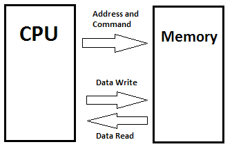

# Memory Speed Requirements

The W65C02S requires external memory to be useful. Further it requires that
this memory supply data in a timely manner. This document examines the
requirements that memory must meet to be compatible with the CPU chip.

The following diagram illustrates a very simple system:

Now for our processor, the address consists of 16 address lines labeled A0
through A15. This 16 bit address can generate up to 65,536 unique addresses.
The command consists of a single line, R/W. When this line is low, a write
command is signified, when high, a read command is in progress. In this
design, the processor supplies the address and the command and the memory
returns the data for a read, or accepts the data for a write and that constitutes
a single memory transaction (AKA cycle).

Let's focus on read commands just for now.

This is a simplified version of the timing diagram that appears in the
data-sheet of the W65C02S.

As can be seen, four timing measurements are called out for examination. These
are:

| \#  | Parameter | Description
|:---:|:---------:|---------------------
| 1   |  tCYC     | The amount of time in each clock cycle.
| 2   |  tADS     | The address/command setup time.
| 3   |  tDSR     | The read data setup time.
| 4   |  tACC     | The memory access time.

Note that all times are normally specified in units of _nano-seconds_ or
0.000000001 seconds. Even in a retro computer, things happen pretty quickly.

So let's take a deeper look at these parameters.

## The Clock Cycle Time: tCYC

The tCYC is determined exclusively by the clock frequency that we have
selected for our computer. It is computed by the simple formula:

    tCYC (in seconds) is 1/frequency (in Hertz)

Now it is more convenient to specify frequency in Megahertz (MHz) and the time
in nano-seconds. factoring all that in we get:

    tCYC (in nano-seconds) is 1000/frequency (in Megahertz)

Some classic values are:

 F   | tCYC | Notes
:---:|:----:|-------
 1   | 1000 | 1 MHz, the speed of the classic PET or Apple \]\[.
 2   |  500 | 2 Mhz, the speed of the prototype Commander X 16.
 4   |  250 | 4 Mhz, the classic top speed of the Z-80.
 8   |  125 | 8 Mhz, the target speed of the  Commander X 16.
 14  | 71.4 | 14 Mhz, the maximum speed of the W65C02S
 16  | 62.5 | 16 MHz, anyone for a little over-clocking?

Now the time of one clock cycle is the total amount of time available for a
memory cycle to complete its work. Everything must fit into that single time
parameter. Additional overheads deduct from this amount a result in the
memory needing to be even faster to keep things working.
