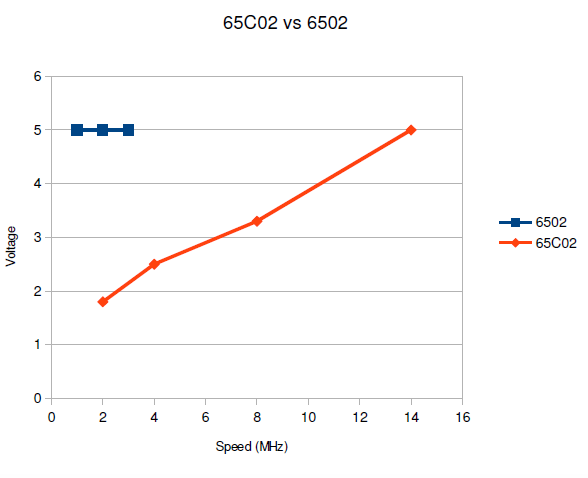

# What's New in the 65C02?

The first question that arises is exactly what processor chips are we going to
compare? It turns out that there have been a lot of old-school NMOS 6502 chips
through the years as well as quite a few parts called 65C02. We can however
simplify things be specifying that we will look at the classic 6502 produced
by MOS TECH and the 65C02 made by WDC and planned for the Commander X 16
project. Other parts are not relevant to this study.

The comparison will be made on the basis of the hardware and software
differences between the chips with an emphasis on those factors that affect
the Commander X 16 project.

## Programming

### New Instructions

### New Addressing Modes

The 65C02 adds three entirely new addressing modes. Further, it enhances a
number of instructions by adding in addressing modes that were omitted in the
6502.

### Bug Fixes

## Hardware

### Power Supply

### Voltage and Speed

### Clocking

