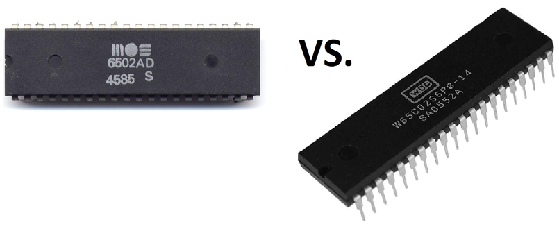

# What's New in the 65C02?

The first question that arises is exactly what processor chips are we going to
compare? It turns out that there have been a lot of old-school NMOS 6502 chips
through the years as well as quite a few parts called 65C02. We can however
simplify things be specifying that we will look at the classic 6502 produced
by MOS TECH and the 65C02 made by WDC and planned for the Commander X 16
project. Other parts are not relevant to this study.

The comparison will be made on the basis of the hardware and software
differences between the chips with an emphasis on those factors that affect
the Commander X 16 project.

## Programming

### New Instructions

### New Addressing Modes

The 65C02 adds three entirely new addressing modes. Further, it enhances a
number of instructions by adding in addressing modes that were omitted in the
6502.

### Bug Fixes

## Hardware

### Compatibility

Here's a common myth: "The 65C02 is a fully pin compatible, drop-in replacement
for the 6502". Here's a look at some device pin-outs with differences
highlighted in bold:

Myth BUSTED! Not only are four pins different between the two chips, at least
one pin is seriously incompatible. Let's examine these in detail:

#### Pin 1

This is the serious case. Let's examine the scenario where a 65C02 is plugged
into a socket that was originally designed for a 6502.

On the 6502, pin 1 is a Vss or Ground pin. As such it would normally be
connected to the Ground line of the printed circuit board (PCB). Even in older
designs where the PCB had only two layers, the Ground line would normally be
a more robust connection to be able to handle a large amount of current. In
more modern designs with four (or more) layers, an entire layer, consisting of
essentially a full sheet of copper would be used for Ground. This Ground layer
(or Ground plane as it often called) can handle large current flows with
negligible resistance to that current flow.

On the 65C02, pin 1 is the Vector Pull line. The 65C02 data sheet says of this
line that:

_VPB is low during during the last interrupt sequence cycles, during which
time the processor reads the interrupt vector_

Now when Vector Pull is low there is no issue. A pin is driving low to a PCB
where it is hardwired low. When the pin tries to return to a high state is
another matter. A transistor in the chip attempts to raise the pin to a one
or high voltage state. The PCB is having none of that. It sinks all the
current it needs to to keep the pin low. As a result, a great deal of current
flows through the pin and the transistor connected to it. This can damage
the chip and cause it to stop working reliably. Bad news!

##### Fixes

* If the PCB does not ground pin 1, then there is no problem.
* Otherwise, you can bend out pin 1 so it does not connect with the socket.
* If you have soldered directly to the PCB, you can cut off pin 1 with a
pair of side-edge cutters.
* If you don't want to mangle your 65C02 you can mount it in a socket where
pin 1 has been removed and plug that socket into the PCB socket.

### Power Supply

### Voltage and Speed

### Clocking

