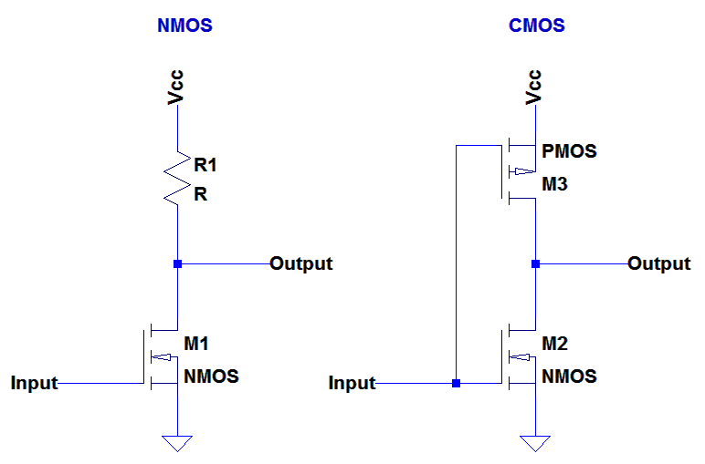
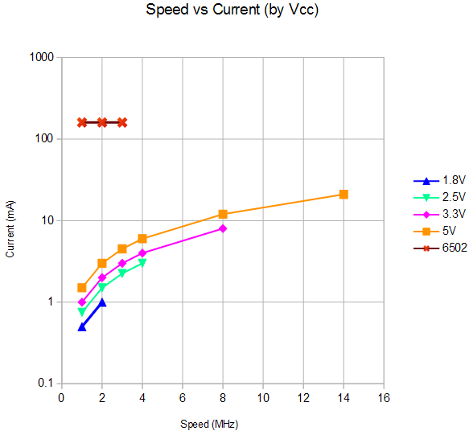

# Chip Process: NMOS vs CMOS (Optional)

A lot of the differences between the 6502 and the 65C02 come down to the
process used to create the chips. This document will take a simplified look
at how these design features make a dramatic impact on the resulting chips.

The original 6502 was an NMOS device with features sized at the 8 &mu;m with
an advertised die size of 3.9 mm &times; 4.3 mm, or an area of 16.6 mm&sup2;
The layout of the chip, its transistors, its interconnect wiring and its
internal registers were all drawn by hand on a huge six layered drawing.
Initially speeds were restricted to 1 MHz, but eventually, parts were
produced as fast as 4 MHz. All of these devices are designed to operate
with a 5 volt power supply.

The 65C02 is a CMOS device based on designs from WDC. WDC is a fabless
chip maker that designs chips but has no manufacturing facilities of its
own. Actual chips are available as are IP models based on
[GDSII](https://en.wikipedia.org/wiki/GDSII)
Hard Cores and
[Verilog](https://en.wikipedia.org/wiki/Verilog)
RTL Soft Cores.

## NMOS vs CMOS

Let's take a look at the layout of a simple NOT gate in NMOS and CMOS:

Let me start be saying that these are highly simplified. For example the
resistor (R1) shown in the NMOS case is in fact a transistor. It is wired up
in such a way that it _acts_ just like a resistor. So how do these design
choices affect the behavior of the resultant chip?

Consider the NMOS design. The transistor, M1 can either be on or off. If it
is off, no current flows and the output is high (a one). If it is on, current
flows and the output is low (a zero). The current consumed is a function of
the number of ones and zeros in the system. Since, on average, these balance
out, the current takes on a fairly constant value. Further, given that a
substantial amount of current must flow through the resistor, this level of
current will in fact be fairly high. Now a small amount of current must flow
to charge or discharge the gate of M1, but this amount is small enough to
have little impact on the total current.

In the CMOS design, when M2 is on, M3 is off and the output is low (a zero)
and when M2 is off, M3 is on and the output is high (a one). There is never
a direct current path through the gate. The static current draw is essentially
zero (excluding leakage currents) whether the output is zero or one. The only
current flow left is the current is needed to charge or discharge the gates
of M2 and M3.

So what are the consequences of these choices. There quite a few actually.

### Supply Voltage

Since the NMOS design relies on the current flow through a resistor, and that
flow highly sensitive to the supply voltage, NMOS devices only operate over
a narrow voltage range. The 6502 is specified for 5 volts &plusmn;5% or from
4.75 to 5.25 volts.

The CMOS design never lets current flow through a load resistor. The power
supply voltage only needs to be enough to turn on the gates of the
transistors while not being so high as to risk damaging the gates of those
transistors. Thus the CMOS 65C02 is specified over the much larger range
of 1.71 to 5.25 volts. Further, since lower voltages mean that the gates
of the transistors are charged "up" to a lower voltage too, lower supply
voltages result in a savings in current too.

This is so dramatic, it's worth seeing in a chart:

Due to the large range of current values that need to be represented, the
chart uses a logarithmic scale for the current. You can see how the vertical
axis labels increase by a factor of ten each time. This shows how the old
school 6502 uses a lot more current that the newer W65C02.
